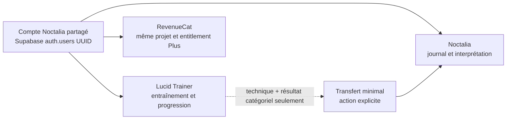

# Noctalia Lucid Trainer — rapport de passation

**État vérifié :** 17 août 2026

**Worktree :** `C:\Users\thann\.codex\worktrees\4574\dreamer`

**HEAD :** `27ed6f6d6`, détaché

**Statut :** produit largement implémenté ; qualification release et preuves appareil encore requises

Ce document est destiné à l’agent qui reprend l’implémentation et la qualification de Noctalia Lucid Trainer. Il complète :

- [l’architecture](LUCID_TRAINER_ARCHITECTURE.md) ;
- [le runbook de release](LUCID_TRAINER_RELEASE.md) ;
- [l’ADR sur l’identité Noctalia partagée](LUCID_TRAINER_SHARED_IDENTITY_ADR.md).

## 1. Verdict

Le périmètre produit est presque entièrement implémenté dans le code et les validations locales sont solides. Aucun défaut P0 connu ne subsiste dans la logique locale. Le worktree n’est cependant pas encore un candidat de release prouvé, principalement parce que :

- les migrations Supabase n’ont pas été appliquées ni testées sur une base réelle ;
- RevenueCat, OAuth et les domaines associés ne sont pas configurés pour l’application compagnon ;
- aucun projet natif n’a été généré et aucun binaire Lucid n’a été construit ;
- aucune validation Android/iOS sur émulateur ou appareil réel n’a été produite ;
- quatre chantiers source limités restent à traiter avant le gel du candidat.

## 2. État Git à préserver impérativement

Le worktree contient **87 entrées non validées par Git** :

- 46 fichiers suivis modifiés ;
- 41 fichiers ou dossiers non suivis ;
- aucune branche active, car HEAD est détaché ;
- aucun commit, push ou PR n’a été créé.

Ne pas lancer :

```text
git clean
git reset
git checkout --
git add -A
```

Commencer toute reprise par :

```powershell
git status --short
git rev-parse HEAD
git branch --show-current
```

Les profils `.env.lucid` et `.env.lucid.mock` sont non suivis. Ils doivent être examinés avant toute inclusion et ne doivent jamais contenir de secret. Une branche, un commit, un push ou une PR nécessitent une autorisation explicite distincte.

## 3. État fonctionnel

| Domaine | État source | Reste à prouver ou terminer |
| --- | --- | --- |
| Variante compagnon | Package/bundle distincts, shell Lucid et configuration fail-closed | Build natif et enregistrement stores |
| Navigation et UI | 22 routes, cinq onglets, écrans secondaires et modales | QA visuelle réelle et quelques fallbacks à froid |
| Onboarding | Objectifs, expérience, sommeil, accessibilité, consentements et permissions contextuelles | Parcours réel dans les cinq langues |
| Programmes | MILD, SSILD et WBTB, sept séances, calendrier et contenus sourcés | Relecture scientifique/juridique finale |
| Tests de réalité | Contexte, fréquence et notifications réconciliées | Preuve appareil DST, redémarrage et permissions |
| Signaux nocturnes | Notifications natives `DATE`, neuf sons atténués, expiration et sécurité | Nouveau build natif et preuve Doze/appareil |
| Suivi et progression | Expériences, rappel, lucidité, sommeil, méthodes, tendances et bilan hebdomadaire | QA avec données réelles sur plusieurs semaines |
| Coaching | Adaptation déterministe hors ligne | L’IA reste volontairement absente et non nécessaire |
| Offline et sync | Snapshot local, file durable, conflits, tombstones et reset fence | Migration Supabase appliquée et tests réels |
| Confidentialité | AES-256-GCM natif, export, suppression locale/cloud-first | Audit appareil et revue légale |
| Compte partagé | Auth Noctalia commune et import invité explicite | Configuration OAuth/redirects extérieure |
| Noctalia Plus | Paywall, achat/restauration, entitlement partagé prévu | App RevenueCat Lucid, produits et clés propres |
| Deep links | Passage minimal consenti et fallback HTTPS | AASA, assetlinks, DNS et validation installée |
| Analytics | Opt-in explicite, allowlist, Android et iOS consentis, ingest `android \| ios` | Guest iOS sans App Attest ; migration distante non appliquée |
| Localisation | FR, EN, ES, DE et IT embarqués | Relecture humaine finale |
| Documentation | Architecture, runbook, science, limites et ADR identité | Compléter avec les preuves de release |

### Carte d’architecture



## 4. Correctifs déjà intégrés

Les défauts découverts pendant l’implémentation et déjà corrigés comprennent :

- alignement des identifiants d’onboarding avec le modèle canonique ;
- correction des destinations de notifications nocturnes ;
- fallback de navigation pour les principales routes ouvertes à froid ;
- annulation des rappels et signaux nocturnes lors de la suppression locale ;
- suppression cloud-first pour un compte connecté, même si la synchronisation a été désactivée ;
- tombstones et reset fence empêchant un appareil hors ligne de recréer des données supprimées ;
- refus anticipé d’un snapshot chiffré dépassant la capacité de stockage ;
- conservation du ciphertext lors d’une erreur SecureStore temporaire ;
- analytics Lucid désactivé par défaut jusqu’au consentement explicite ;
- suppression des clés RevenueCat et du schéma Google hérités de Noctalia dans la variante Lucid ;
- échec explicite de la configuration lorsqu’un seul identifiant Google companion est fourni ;
- suppression de la fusion automatique des données invitées lors d’une connexion ;
- import invité explicite, confirmé par l’utilisateur, conservant les données en cas de refus ou d’erreur ;
- redirection email spécifique à `https://lucid.noctalia.app/lucid/account` ;
- portabilité Windows des scripts Android/npm ;
- recherche d’ADB dans `%LOCALAPPDATA%\Android\Sdk\platform-tools\adb.exe`.
- fallback `canGoBack` / `replace` pour account, data, permissions et séance, y compris l’ouverture à froid de `/lucid/account` ;
- analytics consentie étendue à iOS, avec ingest `android | ios` et guest iOS volontairement fermé sans App Attest ;
- `set-state-in-effect` du contexte Lucid évité : reset de compte pendant le render, sync au chargement/opt-in, réconciliation au bootstrap et au foreground.

## 5. Travaux source restants

Les fallbacks de navigation à froid, l’extension analytics iOS consentie et les avertissements `set-state-in-effect` du contexte Lucid ont été traités dans cette reprise. Voir la section 4.

### P1 supply-chain — Vulnérabilités npm

La commande suivante doit être relancée sur l’état courant :

```powershell
npm audit --omit=dev --audit-level=high
```

La correction automatique proposée installe `expo@53.0.27`, ce qui constitue un downgrade cassant depuis SDK 57. Ne pas lancer `npm audit fix --force`. Cette reprise n’a pas relancé l’audit (scan host large) et conserve l’analyse d’exploitabilité précédente : vulnérabilités principalement transitives (`image-size`, `uuid` via Expo/Metro). Acceptation temporaire jusqu’à une mise à jour compatible SDK 57.

### Décision analytics iOS (traitée)

L’analytics consentie est étendue à iOS :

- le client collecte sur Android et iOS lorsque le flag est actif ;
- l’API et la contrainte SQL acceptent `platform: android | ios` (`20260817012000_product_analytics_events_platform_ios.sql`) ;
- la livraison guest reste Android-only (Play Integrity) ;
- une session iOS authentifiée utilise le bearer Supabase existant ;
- les événements guest iOS restent en file locale jusqu’à connexion ou expiration TTL.

App Attest pour l’ingest guest iOS reste un chantier de release ultérieur.

## 6. Décision sur la base utilisateur Noctalia

### Recommandation

Partager l’identité utilisateur, mais ne pas considérer toutes les données produit comme un domaine commun.

Le modèle recommandé et déjà retenu est :

- même projet Supabase Auth ;
- même UUID immuable `auth.users.id` ;
- mêmes identifiants et récupération de compte ;
- même projet RevenueCat et même entitlement Noctalia Plus ;
- application RevenueCat et clé SDK distinctes pour Lucid ;
- tables `lucid_trainer_*` séparées ;
- RLS propriétaire sur chaque table ;
- synchronisation, analytics et transfert vers Noctalia consentis séparément ;
- aucun access token ou refresh token transmis par deep link ;
- session SecureStore propre à chaque application installée.

Ce modèle offre la meilleure expérience pour deux produits du même éditeur et simplifie la récupération, la suppression du compte et l’entitlement partagé.

### Limite à conserver en tête

Dans un projet Supabase partagé, le cloisonnement entre applications est logique, pas cryptographique. Un JWT appartient au projet entier. Les politiques RLS protègent les autres utilisateurs, mais une session Lucid pourrait techniquement présenter son token aux autres tables du même projet si leurs politiques autorisent cet utilisateur.

Si une séparation réglementaire ou organisationnelle stricte devient nécessaire, il faudra envisager :

- deux projets Auth avec fédération ; ou
- une passerelle serveur et des claims/audiences propres à chaque application.

Avec le même responsable de traitement, la même politique de compte et le même abonnement, ce surcoût ne paraît pas justifié pour la première release.

## 7. Gates externes indispensables

### Supabase

Après autorisation explicite :

1. revoir puis appliquer :
   - `supabase/migrations/20260813010000_lucid_trainer_sync.sql` ;
   - `supabase/migrations/20260813011000_product_analytics_lucid_events.sql` ;
   - `supabase/migrations/20260817012000_product_analytics_events_platform_ios.sql` ;
2. tester avec deux utilisateurs authentifiés et un client anonyme ;
3. vérifier les RPC de push, pull et suppression ;
4. prouver les tombstones, le reset fence et le rejet d’une ancienne file offline ;
5. ajouter `https://lucid.noctalia.app/lucid/account` aux redirect URLs autorisées ;
6. préparer rollback, restauration et réponse incident.

La base Supabase locale n’était pas disponible sur `127.0.0.1:54322`. Aucun contrat SQL réel de ces migrations n’a donc été exécuté.

### RevenueCat

- créer l’application Lucid dans le même projet RevenueCat ;
- conserver exactement le même entitlement Plus ;
- déclarer les produits Lucid correspondants ;
- fournir les clés SDK publiques propres à chaque store ;
- utiliser le même UUID Supabase après connexion ;
- tester achat, restauration, expiration, changement de compte, réinstallation et cache offline.

### Auth externe

- créer des clients Google propres à `com.tanuki75.noctalia.lucid` ;
- configurer redirects et empreintes Android/iOS ;
- garder Google masqué tant que la configuration n’est pas complète ;
- avant Google sur iOS, ajouter Sign in with Apple ou obtenir une exception documentée à la guideline 4.8.

### Liens et domaine

- publier et vérifier `lucid.noctalia.app` ;
- publier AASA pour iOS ;
- publier `assetlinks.json` pour Android ;
- tester le lien de confirmation de compte ;
- tester Noctalia installé et absent ;
- vérifier que le fallback HTTPS public ne dépend pas d’une route native inexistante.

### Natif et appareils

Aucun `expo prebuild`, build, install ou test appareil n’a été effectué.

Après autorisation, il reste à :

- produire un build Android avec le package Lucid ;
- produire un build iOS avec le bundle Lucid ;
- inspecter AndroidManifest et Info.plist ;
- vérifier les neuf sons natifs ;
- tester redémarrage, Doze, suspension JavaScript, DST et fuseau ;
- tester permissions refusées puis accordées ;
- tester haut-parleur, interruption audio et volume réel ;
- vérifier TalkBack, VoiceOver, grandes polices et réduction des animations ;
- vérifier petits téléphones, tablettes et modes clair/sombre ;
- tester achat/restauration sur les stores réels.

### Produit, vie privée et stores

- obtenir une relecture humaine des cinq langues ;
- faire valider les limites scientifiques et le positionnement bien-être ;
- vérifier les formulaires App Privacy/Data Safety contre les flux réels ;
- préparer une fiche store démontrant l’autonomie de Trainer par rapport à Noctalia ;
- obtenir les validations juridiques et produit nommées ;
- ne soumettre qu’après clôture de la matrice de preuves du runbook.

## 8. Preuves locales disponibles

Validations relancées sur l’état consolidé :

| Validation | Résultat |
| --- | --- |
| `npm test -- --runInBand --silent` | 290 suites, 2 690 tests, 0 échec |
| `npm run typecheck:app` | Passe |
| `npm run typecheck:tests` | Passe |
| `npm run lucid:gates` | Toutes les gates passent |
| `npx --yes expo-doctor` avec cache temporaire | 21/21 |
| `npm run lint` | 0 erreur, 54 avertissements globaux |
| Lint du périmètre Lucid | 0 erreur, 3 avertissements |
| `git diff --check` | Passe |
| Audit sécurité mobile | 0 fail, 6 warnings, 3 manuels, 14 pass |

Les gates Android générales du dépôt donnent `10 pass, 1 fail, 4 blocked, 4 manual`. Elles ne prouvent pas le compagnon Lucid : aucun appareil n’était connecté, Maestro était absent et les états Play/RevenueCat n’étaient pas finalisés.

### Limites des preuves

- Les tests Jest, types et lint sont des preuves locales uniquement.
- `lucid:gates` prouve la configuration source, pas un manifest ou un binaire.
- Expo Doctor prouve la cohérence des dépendances, pas le comportement natif.
- Aucun résultat Android signé, iOS, store, Supabase déployé ou appareil réel ne doit être revendiqué.

### Contournement Expo Doctor sous Windows

Le cache npm Windows par défaut peut échouer avec `EPERM`. Utiliser un cache temporaire isolé :

```powershell
$env:npm_config_cache = Join-Path $env:TEMP 'noctalia-expo-doctor-cache'
npx --yes expo-doctor
```

## 9. Fichiers à lire en premier

1. `doc_web_interne/docs/LUCID_TRAINER_ARCHITECTURE.md`
2. `doc_web_interne/docs/LUCID_TRAINER_RELEASE.md`
3. `doc_web_interne/docs/LUCID_TRAINER_SHARED_IDENTITY_ADR.md`
4. `app.config.ts`
5. `context/LucidTrainerContext.tsx`
6. `lib/lucid/model.ts`
7. `services/lucidTrainerSync.ts`
8. `services/lucidTrainerNotifications.ts`
9. `services/lucidTrainerSecureStorage.ts`
10. `supabase/migrations/20260813010000_lucid_trainer_sync.sql`

## 10. Ordre recommandé pour la reprise

1. Lire `AGENTS.md` et les trois documents Lucid.
2. Exécuter `git status --short` et préserver le WIP.
3. Relancer tests, types, lint, gates Lucid et Expo Doctor.
4. Faire une revue de diff complète, y compris les fichiers non suivis.
5. Demander une autorisation avant branche, commit, push ou PR.
6. Demander séparément l’autorisation pour Supabase, les fournisseurs, les builds natifs et les stores.

### Commandes de reprise sûres

```powershell
git status --short
node --version
npm --version
npm run typecheck:app
npm run typecheck:tests
npm test -- --runInBand --silent
npm run lucid:gates
npm run lint
git diff --check

$env:npm_config_cache = Join-Path $env:TEMP 'noctalia-expo-doctor-cache'
npx --yes expo-doctor
```

Ne pas lancer sans autorisation explicite :

- `expo prebuild` ;
- un build EAS ou natif ;
- `npm audit fix --force` ;
- une migration distante ;
- une modification RevenueCat/OAuth/DNS ;
- un commit, push, PR, déploiement ou une soumission store.
