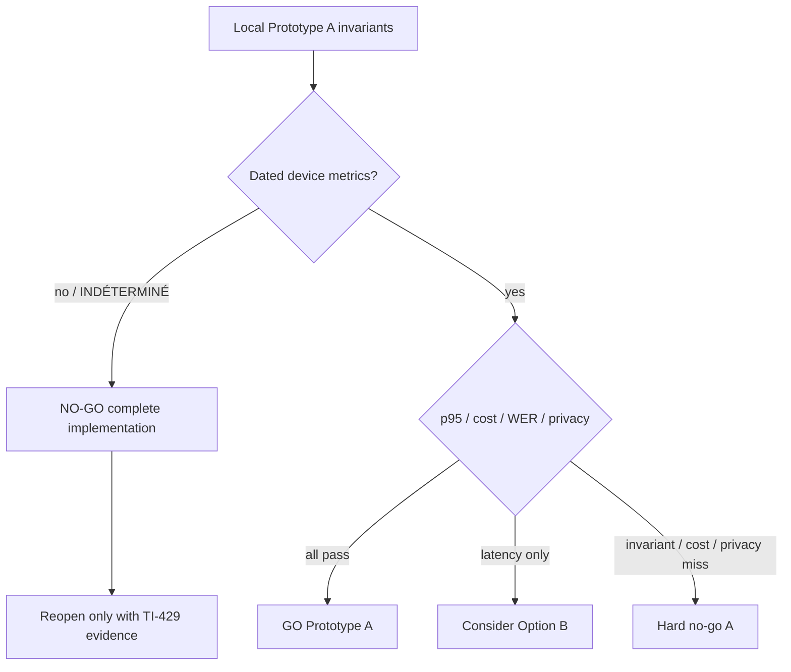

# Dreamer Voice Live Spike V3 (TI-428)

Internal prototype kernel for an optional live voice loop after a persisted
original dream. This ticket is local and read-only of TI-427: it reuses persist
ids, hashes, closed recall intents, and the add -> persist -> request contract.
It does not modify `lib/dreamRecallAssistant.ts`, product Home/Journal/Trends
screens, backend, Linear, or device proof. Device evidence stays on TI-429.

## Goal

Decide whether Prototype A can host a barge-in voice loop without speaking or
thinking before the last user segment is confirmed persisted.

## Non-goals

- Backend, quota RPCs, chat routes, or Gemini calls
- Linear issue mutation
- Device or Motorola proof (TI-429)
- Shipping Option B
- Production settings toggle or product-surface mount

## Prototype A (only candidate now)

Native STT -> confirmed persist -> text AI -> `expo-speech`.

| Gate | p95 / budget |
|---|---|
| End of speech to persist ack | 1_200 ms |
| Persist ack to first AI token | 2_500 ms |
| First token to audible TTS | 700 ms |
| Barge-in to speech stop | 250 ms |
| Cost / 5-turn session | USD 0.05 |
| Privacy | audio retention off by default; original transcript never enters AI turns |
| Quota | remaining quota and max AI turns must block `request_ai` / `speak` |

Option B (realtime audio in and out) is documented only as a fallback. It is
eligible after a Prototype A **no-go that is latency-only**. Invariant, cost,
privacy, or quota failures are a hard no-go, not a reason to start B.

## Kernel

Pure persistable module: [`lib/voiceLiveSpike.ts`](../../../lib/voiceLiveSpike.ts).

Statuses: `idle`, `listening`, `await_persist`, `thinking`, `speaking`,
`interrupted`, `paused`, `offline`.

The prototype stays behind `dreamer.voiceLiveSpike.v3`, off by default
(`VOICE_LIVE_SPIKE_FEATURE_ENABLED_DEFAULT = false`). Start without an explicit
`eligibility.featureEnabled: true` stays idle and returns
`ineligible / feature_disabled`.

Commands are host instructions, never I/O:

- `listen`, `await_persist`, `request_ai`, `speak` (`tts: 'expo-speech'`)
- `stop_speech`, `queue_offline`, `paused`, `offline`, `interrupted`, `flag`
- `ineligible` with a closed reason

`request_ai` reuses the TI-427 shape: `intent`, `dreamId`,
`originalTranscriptHash`, `originalPersistedSegmentId`, optional
`originalTranscriptRef`, `turnIndex`, `persistedSegmentId`. It never carries
`originalTranscript`. Recall uses `recall_question`. Analysis and chat use
`analysis_turn` / `chat_turn`.

## Isolated host and storage

Prototype A host, off by default, `__DEV__` plus explicit debug enablement plus
the existing `dreamer.voiceLiveSpike.v3` local flag:

| Boundary | Location |
|---|---|
| Gate / persist-first loop / stub AI | [`lib/voiceLiveSpikeHost.ts`](../../../lib/voiceLiveSpikeHost.ts) |
| Session lane | `voice_live_spike_v3:{dreamId}` via [`services/voiceLiveSpikeStorage.ts`](../../../services/voiceLiveSpikeStorage.ts) |
| Debug enablement | `dreamer.voiceLiveSpike.v3.debug` |
| Local flag | `dreamer.voiceLiveSpike.v3.flag` |
| TTS after persist | [`services/voiceLiveSpikeTts.ts`](../../../services/voiceLiveSpikeTts.ts) (`expo-speech`) |
| Native STT reuse | `useRecordingSession` inside [`components/dev/VoiceLiveSpikeHost.tsx`](../../../components/dev/VoiceLiveSpikeHost.tsx) |
| Route | [`app/dev/voice-live-spike.tsx`](../../../app/dev/voice-live-spike.tsx) returns `null` outside `__DEV__` |
| Settings entry | [`components/dev/VoiceLiveSpikeDebugEntry.tsx`](../../../components/dev/VoiceLiveSpikeDebugEntry.tsx) returns `null` outside `__DEV__` |

The host hydrates that spike lane before `start`. A valid stored session is
resumed; a missing/idle snapshot starts a new Prototype A chat loop. `remove`
clears only `voice_live_spike_v3:{dreamId}`. AI is a local deterministic stub.
If the stored command is `await_persist`, the loaded snapshot is already durable:
the host marks the segment persisted, then continues online or queues offline.
It never requests AI or TTS before that persist.
No Gemini, backend, quota RPC, or purchase path. The original transcript stays
off the stub request and spoken turns.

Production cannot mount or start the host: `canMountVoiceLiveSpikeHost` requires
`__DEV__`, debug enablement, and the local flag, while the feature default stays
`false`.

## Invariants

1. Never emit `request_ai` or `speak` before the latest user segment is
   persisted. Unpersisted capture stays on `await_persist`.
   `commandForVoiceLive` must not emit `speak` without a persisted anchor,
   including hydrated or forged `status=speaking` snapshots. Hydration rejects
   those snapshots as `invalid_state`.
2. The original dream transcript is a separate lane. Recall, analysis, and chat
   turns must not copy it. Commands point at persisted ids / hashes only.
3. Audio retention is `off` unless the caller explicitly opts in.
4. Offline capture may persist and queue. It must not answer, think, or speak.
5. Barge-in from `thinking` or `speaking` stops speech, keeps the last
   persisted segment, and lands on `interrupted`. Reprise returns to listening
   (or offline) without inventing a new AI turn.
6. Pause stores a resume target. Resume never skips persist confirmation.
7. Eligibility and budgets (`remainingQuota`, `maxAiTurns`, session duration,
   microphone / speech availability) can only produce `ineligible`, never a
   silent AI/TTS command.

## Happy path (Prototype A)

1. Original narration is already persisted (TI-427). Spike starts from that id.
2. Recall / analysis may request the first AI turn from
   `originalPersistedSegmentId`. Chat waits for a user segment.
3. User speech becomes an unpersisted pending segment (`await_persist`).
4. Host confirms persist. Kernel moves to `thinking` and may emit `request_ai`.
5. Host appends a bounded utterance. Kernel moves to `speaking` / `speak`.
6. User barge-in issues `stop_speech`, preserves the last persisted segment,
   and waits for reprise.
7. Offline: persist if needed, `queue_offline`, no response.

## Follow-ups (not created)

| Ticket / work | Status |
|---|---|
| TI-429 | Device proofs remain required. The 2026-09-03 matrix now names the live-voice rows; they are still unproven. |
| Isolated `/dev/voice-live-spike` host | Local TI-428 prototype. Not a product surface. |
| Option B only if TI-428/429 record a latency-only A no-go | Not created. Do not invent a Linear id. |

## Proof split

| Layer | This ticket |
|---|---|
| Local kernel / Jest / typecheck / lint | TI-428 |
| Isolated host / storage / stub AI | TI-428 |
| Public HTTP, Play, EAS, backend | out of scope |
| Human / device | TI-429, currently unproven. See the 2026-09-03 decision. |

## Decision — 2026-09-03

**NO-GO for complete implementation now.** This is not a technical failure of
Prototype A, and it is not a go.

`evaluateVoiceLiveGoNoGo` already encodes the split: missing TI-429 proof returns
`blocked_ti_429`, not `go_a` and not `no_go_a`. Option B stays ineligible until a
recorded Prototype A no-go is **latency-only**. Unmeasured p95 is not a latency
miss.



### Proven locally

- Persist-before-AI/TTS: `request_ai` and `speak` stay blocked on `await_persist`.
- Original transcript isolation: recall / analysis / chat point at ids and hashes only.
- Audio retention defaults to `off`.
- Offline capture may persist and queue; it must not think or speak.
- Barge-in from `thinking` or `speaking` stops speech, keeps the last persisted
  segment, and lands on `interrupted`.
- Quota and max AI turns emit `ineligible`, never a silent AI/TTS command.
- Isolated host remains `__DEV__` + debug enablement + `dreamer.voiceLiveSpike.v3`,
  off by default. AI is a local deterministic stub. No Gemini, backend, quota RPC,
  or purchase path.

Those proofs are Jest / typecheck / lint on the kernel and isolated host. They are
not device proof, not Release-binary proof, and not model-cost proof.

### INDÉTERMINÉ — not measured, not failed

| Gate | Budget | Evidence 2026-09-03 |
|---|---|---|
| p95 end of speech → persist ack | 1_200 ms | INDÉTERMINÉ — no dated device timing |
| p95 persist ack → first AI token | 2_500 ms | INDÉTERMINÉ — stub first token is not model latency |
| p95 first token → audible TTS | 700 ms | INDÉTERMINÉ — no dated audible TTS timing |
| p95 barge-in → speech stop | 250 ms | INDÉTERMINÉ — no dated barge-in timing |
| WER French | record substitutions / deletions / insertions | INDÉTERMINÉ — no FR spoken corpus |
| WER English | same | INDÉTERMINÉ — no EN spoken corpus |
| Cost / 5 persisted AI turns | USD 0.05 | INDÉTERMINÉ — local stub is USD 0.00 and is not model-cost proof |
| Offline persist + queue, no answer | invariant 4 | Local kernel only; device unproven |
| Interruption / reprise | invariant 5 | Local kernel only; device unproven |
| Privacy | retention off; original transcript never in AI turns; no audio upload | Local kernel only; device unproven |

Do not relabel an absent measurement as `no_go_a`. Do not feed placeholder zeros
into `evaluateVoiceLiveGoNoGo`. A `$0` stub is not a 5-turn session under budget.

### Reopen only when

1. A dated TI-429 evidence directory records every live-voice row below. Unexecuted
   rows stay `blocked` or `manual`, never `pass`.
2. Device p95 values exist for persist, first model token, audible TTS, and
   barge-in stop. Report p95, not a single happy-path sample.
3. WER is scored on scripted French and English prompts against native STT.
4. Cost is a billed 5-turn text-AI session, not the local stub.
5. Offline, interruption, and privacy are observed on the isolated debug host,
   with the original transcript absent from AI/TTS payloads and audio retention
   still `off` unless the tester opted in.
6. Only then set `deviceProofComplete: true` and evaluate Prototype A. Option B
   remains uncreated unless that evaluation is a latency-only no-go.

This slice does not run Motorola, Linear, commit, push, EAS, Play, or a production
settings toggle.

### Local / device protocol

| Check | Where | How | Pass only if |
|---|---|---|---|
| Persist-before-AI | Local Jest already; device on `/dev/voice-live-spike` | Capture a chat segment, confirm persist, then watch `request_ai` / TTS. Kill or interrupt before persist. | No AI/TTS command before `persistedAt`. Device row stays unproven until recorded. |
| p95 persist | Device debug host | ≥ 20 end-of-speech → persist-ack timestamps. | p95 ≤ 1_200 ms |
| p95 AI | Device + real text model | ≥ 20 persist-ack → first model token timestamps. | p95 ≤ 2_500 ms. Stub tokens do not count. |
| p95 TTS | Device `expo-speech` | ≥ 20 first-token → first audible-speech timestamps. | p95 ≤ 700 ms |
| p95 barge-in | Device while `thinking` or `speaking` | ≥ 20 barge-in → speech-stop timestamps. | p95 ≤ 250 ms; last persisted segment unchanged |
| WER FR | Device native STT | Read a fixed French script, save the transcript, score WER. | Dated FR WER; no silent skip |
| WER EN | Device native STT | Same with a fixed English script. | Dated EN WER; no silent skip |
| Cost / 5 turns | Real text AI, 5 persisted turns | Sum billed USD for that session. | ≤ USD 0.05. A `$0` stub is not model-cost proof. |
| Offline | Airplane mode on the debug host | Capture, persist, queue. | Status `offline` / `queue_offline`; no `request_ai` or `speak` |
| Interruption | Barge-in during TTS, then reprise | Stop speech, keep last persisted segment, return to listen/offline. | No invented extra AI turn |
| Privacy | Debug host + payload inspection | Start without opt-in; inspect `request_ai` / spoken turns / storage. | `audioRetention=off`; original transcript absent; no audio upload |

TI-429 matrix ids: `voice-live-p95-persist`, `voice-live-p95-ai`,
`voice-live-p95-tts`, `voice-live-p95-barge-in`, `voice-live-wer-fr`,
`voice-live-wer-en`, `voice-live-cost-five-turns`, `voice-live-offline`,
`voice-live-interrupt`, `voice-live-privacy`.

## Verification

```bash
npm run test:file -- lib/__tests__/voiceLiveSpike.test.ts
npm run test:file -- lib/__tests__/voiceLiveSpikeHost.test.ts services/__tests__/voiceLiveSpikeStorage.test.ts hooks/__tests__/useVoiceLiveSpikeHost.test.tsx components/dev/__tests__/VoiceLiveSpikeHost.test.tsx components/dev/__tests__/VoiceLiveSpikeDebugEntry.test.tsx
npm run typecheck:app
npx expo lint lib/voiceLiveSpike.ts lib/voiceLiveSpikeHost.ts lib/__tests__/voiceLiveSpike.test.ts lib/__tests__/voiceLiveSpikeHost.test.ts services/voiceLiveSpikeStorage.ts services/voiceLiveSpikeTts.ts services/__tests__/voiceLiveSpikeStorage.test.ts hooks/useVoiceLiveSpikeHost.ts hooks/__tests__/useVoiceLiveSpikeHost.test.tsx components/dev/VoiceLiveSpikeHost.tsx components/dev/VoiceLiveSpikeDebugEntry.tsx components/dev/__tests__/VoiceLiveSpikeHost.test.tsx components/dev/__tests__/VoiceLiveSpikeDebugEntry.test.tsx app/dev/voice-live-spike.tsx
git diff --check -- lib/voiceLiveSpike.ts lib/voiceLiveSpikeHost.ts lib/__tests__/voiceLiveSpike.test.ts lib/__tests__/voiceLiveSpikeHost.test.ts services/voiceLiveSpikeStorage.ts services/voiceLiveSpikeTts.ts services/__tests__/voiceLiveSpikeStorage.test.ts hooks/useVoiceLiveSpikeHost.ts hooks/__tests__/useVoiceLiveSpikeHost.test.tsx components/dev/VoiceLiveSpikeHost.tsx components/dev/VoiceLiveSpikeDebugEntry.tsx components/dev/__tests__/VoiceLiveSpikeHost.test.tsx components/dev/__tests__/VoiceLiveSpikeDebugEntry.test.tsx app/dev/voice-live-spike.tsx app/_layout.tsx app/(tabs)/settings.tsx doc_web_interne/docs/architecture/DREAMER-VOICE-LIVE-SPIKE-V3.md
```
