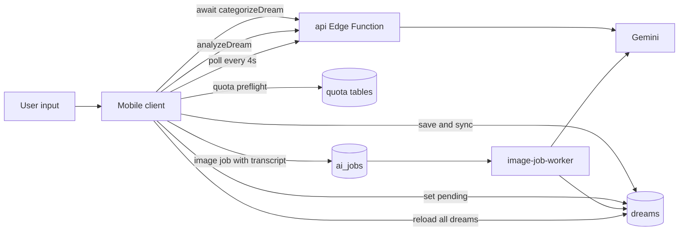
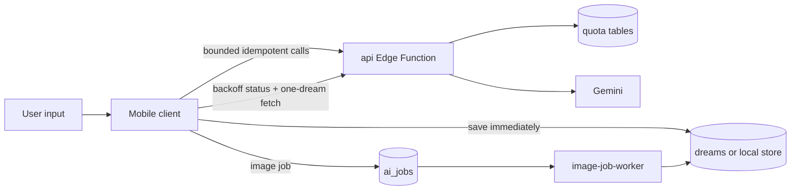
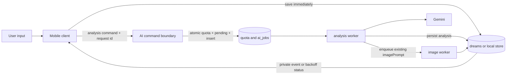
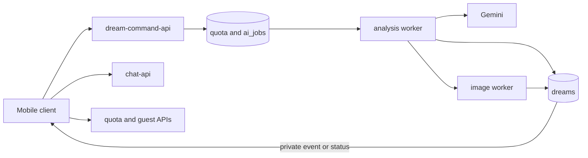

# Security Hardening Proposal: Centralize Paid AI Command Ownership

## Decision

We need one component to own the decision that an AI action may spend money and one durable record to own its lifecycle. The user selected an incremental move to that server-owned boundary while preserving local capture, current image jobs, and compatibility with existing clients.

## Executive Recommendation

The complete option set is:

- **Option 1: Strengthen local controls.** Keep client orchestration, but save first, add input bounds and idempotency, reduce polling, and consolidate quota reads.
- **Option 2: Server-owned durable AI command.** Extend the existing job boundary to analysis; atomically authorize and persist the command, then let workers persist results and enqueue the image.
- **Option 3: Split functions and push completion.** Add Option 2 while also separating API failure domains and making private Realtime the normal delivery path.

I recommend Option 2 under the current constraints. It removes the most important control drift and duplicated work while reusing `ai_jobs`, the image worker, and claim-before-cost RPCs. Option 1 is still valuable as migration protection. Option 3 becomes preferable when production telemetry demonstrates correlated saturation or when independent service ownership justifies the operational cost.

## Evidence

I inspected the actual callers and migrations rather than relying on the March architecture snapshot, which had become stale. The existing durable image queue most influenced the recommendation: we can extend a proven boundary instead of introducing a second orchestration system.

| Evidence | Finding or document | What it establishes |
| --- | --- | --- |
| `E-SAVE` | AI categorization blocks durable save | `app/recording.tsx` and `hooks/useDreamSaving.ts` await `/categorizeDream` before `addDream`. |
| `E-ORCH` | Client owns analysis state | `hooks/useDreamJournal.ts` performs quota preflight, pending sync, analysis, image enqueue, result merge, and another sync. |
| `E-PROMPT` | Image prompt is generated twice | Structured analysis returns `imagePrompt`, the client discards it, and the image worker generates another prompt from the transcript. |
| `E-QUEUE` | Durable image jobs already exist | The `ai_jobs` migration and image worker provide actor-bound idempotency, atomic attempt claim, retries, and persisted completion. |
| `E-POLL` | Completion work grows with journal size | Fixed four-second polling finishes by fetching and hydrating the entire dream collection. |
| `E-QUOTA` | Quota display fans out | The authenticated provider performs several reads and repeats capability calculations. |
| `E-RETRY` | Retry policy can repeat paid work | Analysis and image jobs have stable IDs, while categorization and transcription retries do not have equivalent server result idempotency. |
| `E-INPUT` | Cost bounds are uneven | Transcription is bounded, but analysis, categorization, image-job strings, and authenticated chat messages do not share strict server caps. |
| `E-CHAT` | Chat history is a growing shared JSON value | Each authenticated turn rewrites the full history before and after model generation. |

## Current Design And Failure Mode

The mobile client is both an offline state owner and the coordinator of remote paid work. That is attractive for incremental development because progress is visible in one hook, but it means authorization, persistence, retries, and result composition cross multiple independently failing calls. A lost response can leave quota, dream status, image state, and local state at different points in the lifecycle.

The server already owns the strongest controls. Guest sessions are signed, analysis quota is claimed before cost, and image workers atomically claim queued attempts. The structural problem is therefore not an absence of controls; it is that those controls stop at different boundaries. The image worker persists its result directly, while analysis returns to the client for persistence. The client starts image generation from the transcript before it has the analysis prompt, so a second model call recreates information the analysis already produced.

The before view makes that split visible:

The primary abuse consequence is dispersion: a new route can call a provider after only a UI precheck, a retry can repeat work without result idempotency, and an unlimited subscription can still create unbounded concurrent jobs. The reliability consequence is similar: the client must repair partial state after navigation, offline transitions, or process restart.

## Desired Invariants

- A valid dream is durable before optional AI enrichment begins.
- Every paid provider invocation is authorized server-side against a verified actor immediately before work.
- Every paid command has one stable idempotency key and one durable lifecycle record.
- Actor burst, actor concurrency, global backlog, input, and output budgets are checked before provider work.
- At most one worker owns a particular attempt.
- Analysis persistence and initial image enqueue use the same structured analysis result and `imagePrompt`.
- Client quota status is advisory; only the atomic server command authorizes spend.
- Completion updates only the affected resource and remains recoverable without push delivery.
- Logs and metrics carry route, actor class, job ID, timing bucket, model class, and outcome—not dream text, prompts, audio, tokens, or fingerprints.

## Constraints And Non-Goals

We must preserve local guest recording and the existing offline mutation queue. We do not change the AI vendor, redesign dream interpretation, make `/transcribe` a normal path, or deploy production changes in this work. Splitting every route into a separate Edge Function is not required to establish correct command ownership.

No production measurements are available. Performance directions below are source-derived or hypothetical and include validation plans rather than invented gains.

## Before Architecture

The source diagram is [centralize-ai-command-ownership-before.mmd](../diagrams/centralize-ai-command-ownership-before.mmd). Client-owned analysis persistence and server-owned image persistence are the important boundary mismatch.

## Options

### Option 1: Strengthen Local Controls

This option preserves the current request/response analysis path. We would save before categorization, add strict limits and request IDs, make quota status one snapshot, fetch one completed dream, and add polling backoff. Its strongest case is delivery speed: most changes are additive or client-local, no new worker is required, and rollback is a normal code revert.

Security improves because malformed and duplicate work is rejected earlier, but control ownership still drifts. The client still performs a sequence of state changes around a synchronous provider call, and server analysis results still depend on the client returning to persist them. Per-actor concurrency can be enforced at the route boundary, but there is no durable analysis record to make process restart or a lost response unambiguous.

Resource cost should improve through fewer reads and polls. Memory stays effectively neutral. Reliability improves on capture and image reconciliation but remains exposed to the long analysis request. We can roll it out file by file and keep every tactical control if we later adopt Option 2.

| Change | Before | After | Security consequence | Cost |
| --- | --- | --- | --- | --- |
| Capture | AI precedes save | Save precedes AI | Provider outage cannot block durability | Background enrichment coordination |
| Inputs and retries | Route-specific | Shared bounds and IDs | Narrows cost-amplification paths | Compatibility tests |
| Image completion | Fixed poll plus full reload | Backoff plus targeted read | Less amplification per job | Small client state change |

### Option 2: Server-Owned Durable AI Command

This option extends the existing `ai_jobs` state machine with `analyze_dream`. A service-role-only transaction or RPC resolves the verified actor, checks idempotency, enforces burst/concurrency/backlog policy, claims quota, marks the dream pending, and inserts the job. The public route returns `202` without calling Gemini. A worker atomically claims the attempt, performs structured analysis, writes the analysis fields, and inserts the initial image job with the returned `imagePrompt`.

The attractive part is that a single durable row explains whether paid work was accepted, started, succeeded, or failed. Retries return that row; process restarts do not require the client to reconstruct authority from local state. Server persistence removes the current split where image results are authoritative but analysis results are client-owned. It also gives concurrency and backlog controls a natural place to operate before provider work.

What gives me pause is migration complexity. Authenticated dreams have a stable server row, while guest dreams can remain local. We should therefore move authenticated analysis first and retain the existing idempotent synchronous guest path until a guest job can safely return and cache structured results without pretending a server dream exists. The analysis worker adds queue-age and stuck-job operations, but those are observable failure modes rather than long request ambiguity.

Performance should improve for command acknowledgement and client round trips, while total analysis completion gains one queue hop. Image start may occur after analysis rather than in parallel; it avoids the extra prompt model call but must be measured against time-to-image. Memory grows only through bounded job rows and worker payloads. Rollback is a client feature flag plus stopping new analysis-job creation; existing jobs can drain.

| Change | Before | After | Security consequence | Cost |
| --- | --- | --- | --- | --- |
| Authorization | Spread across preflight and routes | Atomic command transaction | One claim-before-cost boundary | Additive RPC and tests |
| Lifecycle | Client state plus synchronous response | Durable server state machine | Idempotency survives lost responses | Worker operations |
| Analysis persistence | Client writes result | Worker writes result | Removes stale-client authority | Compatibility protocol |
| Image prompt | Discarded then regenerated | Passed from analysis job | Removes a paid prompt-generation path | Image begins after prompt exists |

### Option 3: Split Functions And Push Completion

This option keeps Option 2 and additionally separates guest/quota, dream command, chat, subscription, and workers into distinct Edge Functions. Private Realtime Broadcast becomes the normal completion notification, with job status retained for recovery. Its strongest case is failure containment: an image or analysis saturation event no longer shares a cold-start and concurrency domain with subscription or guest-session requests.

The security boundary is clearer because each function has narrower dependencies and environment authority. A quota function does not need a Gemini key, and a chat function does not need worker credentials. Residual risk moves toward deployment policy: more functions and secrets create more configuration surfaces, and push delivery must never be treated as authorization or proof of completion.

This option introduces the greatest operational burden. It multiplies deployments, dashboards, cold-start profiles, routing compatibility, and rollback coordination. Without latency or saturation evidence, the added isolation may be worthwhile later but is not necessary to fix command ownership now. We can preserve reversibility by keeping route contracts stable and moving one failure domain at a time.

| Change | Before | After | Security consequence | Cost |
| --- | --- | --- | --- | --- |
| Runtime authority | One API has broad dependencies | Functions have scoped dependencies | Smaller credential and saturation blast radius | More deployments and secrets |
| Completion | Polling | Private push plus recovery polling | Push leaks neither authority nor cross-user state when channels are private | Subscription lifecycle complexity |
| Failure isolation | Shared API domain | Independent domains | Provider degradation need not affect quota/session routes | Cross-service observability |

## Comparison

| Dimension | Option 1: Local controls | Option 2: Durable command | Option 3: Split and push |
| --- | --- | --- | --- |
| Security | Improves known entry points; ownership still dispersed | Strong central spend and lifecycle boundary | Strongest authority and failure isolation |
| Performance | Fewer calls and bytes; analysis remains long request | Fast acknowledgement; one queue hop; one fewer prompt call | Similar work plus possible cold starts across functions |
| Memory | Neutral | Bounded job-row and worker payload growth | Additional runtime instances and connection state |
| Reliability | Better capture and polling; lost analysis response remains ambiguous | Durable restart/retry recovery | Best correlated-failure containment, more distributed failure modes |
| Operability | Lowest change | Queue metrics and stuck-job recovery required | Highest deployment and observability burden |
| Migration | Small and reversible | Additive schema, worker, route, then client flag | Multi-deployment compatibility program |
| Evidence basis | Source-derived, high confidence | Source-derived, medium-high confidence | Hypothetical until saturation telemetry exists |

For every option we should record command latency, completion latency, provider calls per dream, queue age, polling count, and terminal failures on the same scripted workload. The decision threshold for Option 3 should come from observed correlated saturation, not an assumed microservice benefit.

## Recommendation

I recommend Option 2, with Option 1 controls implemented first and retained. It aligns control ownership with the component already responsible for quota and image-job authority, and it directly removes the current lost-response and duplicate-prompt ambiguity. We should introduce it for authenticated analysis first, because that path has a stable server dream identity.

Option 1 alone should win if adding another worker is operationally unacceptable. Option 3 should win if production evidence shows the shared `api` function materially harms session, quota, or subscription availability during AI saturation, or if separate teams need independent deployment authority.

## Evidence Coverage And Residual Risk

| Evidence | Option 1 | Option 2 | Option 3 | Tactical protection retained |
| --- | --- | --- | --- | --- |
| `E-SAVE` — Blocking categorization | Addresses | Addresses | Addresses | Save-first behavior |
| `E-ORCH` — Client lifecycle ownership | Mitigates | Addresses for migrated analysis | Addresses | Compatibility state handling |
| `E-PROMPT` — Duplicate image prompt | Mitigates only if sequential | Addresses | Addresses | Prompt/output cap |
| `E-QUEUE` — Existing durable boundary | Reuses image only | Extends | Extends and isolates | Atomic attempt claim |
| `E-POLL` — Fixed polling/full reload | Addresses | Addresses | Addresses | Recovery polling |
| `E-QUOTA` — Quota read fan-out | Addresses snapshot only | Addresses action authority | Addresses and isolates | Fail-closed server claim |
| `E-RETRY` — Uneven idempotency | Mitigates known routes | Addresses job commands | Addresses job commands | No retry without key |
| `E-INPUT` — Uneven cost bounds | Addresses | Addresses | Addresses | Shared server validation |
| `E-CHAT` — JSON history rewrite | Unaffected | Unaffected initially | Mitigates only if chat migration included | Current per-dream quota |

Residual risk remains from compromised authenticated accounts, distributed attackers creating many valid guest installations, provider-side quota exhaustion, and Plus users whose legitimate high usage resembles abuse. Per-actor limits therefore complement—rather than replace—provider budgets, global queue cutoffs, and anomaly monitoring. Tactical bounds remain necessary after migration.

## Migration And Rollout

We first land request bounds, retry safety, save-first behavior, targeted image reconciliation, and tests. Next we add the job type and atomic command without changing clients, deploy the worker, and exercise it through route tests and a non-production environment. An app feature flag then moves authenticated analysis to jobs. Realtime delivery follows only after status polling proves recovery across restart and offline transitions.

Rollback disables the client flag and command route while allowing accepted jobs to drain. No migration removes existing columns or endpoint behavior during adoption. Legacy endpoints are retired only after supported-build and server-usage evidence shows they are unused.

## Validation Plan

- Run duplicate and concurrent command tests against the atomic RPC.
- Inject lost responses, worker restart, provider timeout, quota outage, and subscription outage.
- Verify malformed and oversized requests never call quota or provider dependencies.
- Compare provider call counts and image prompts for the same dream across current and candidate flows.
- Verify one completed image performs one targeted dream read and that polling stops in background.
- Restart the app during queued, running, succeeded, and failed jobs and reconcile deterministically.
- Confirm logs contain identifiers and outcome metadata but no user content or stable fingerprint.
- Run focused Jest and Deno tests, both TypeScript checks, database contract checks, and the mobile security audit.

## Implementation Work Packages

The selected option is decomposed in [server-owned-ai-command.md](../implementation/server-owned-ai-command.md). Each package is independently reviewable, additive where schema is involved, and keeps existing tactical controls until the new boundary is verified.

## Open Questions

- Which measured Plus workload should define burst and concurrency defaults?
- Should un-analyzed dreams receive any AI categorization automatically, or is a derived local title sufficient until explicit analysis?
- Does the backend intentionally restrict production guest sessions to Android, and how should the UI present iOS capability?
- What queue-age and global-backlog thresholds match the actual Supabase plan and provider budget?
