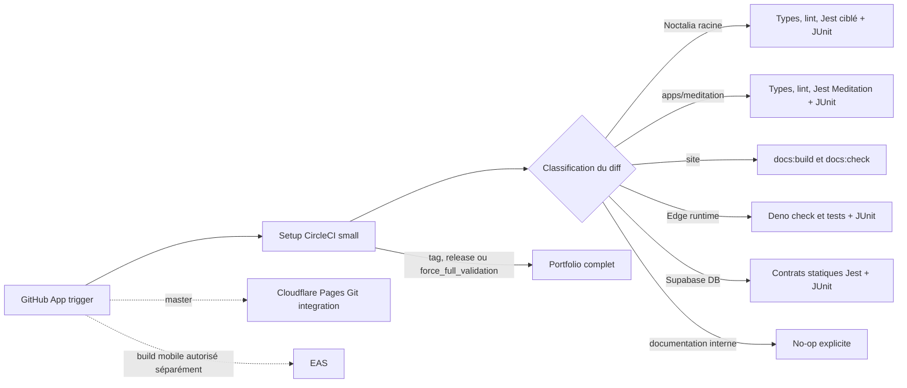

# Migration CI Noctalia vers CircleCI Free

État au 20 août 2026 : CircleCI est configuré en validation pure, sans commande
de déploiement. Le workflow GitHub Actions `Quality` reste présent et aucune
protection de branche n'est modifiée par cette configuration.

## Architecture et frontière des responsabilités

CircleCI ne contient aucune commande `wrangler pages deploy`, `docs:deploy:*`,
`eas build`, `eas submit`, migration Supabase ou publication. Cloudflare Pages
reste responsable du site et EAS des builds mobiles. Les contrôles DB sont
statiques : `db:contract:check` nécessite une base et reste une validation
opérateur, pas un accès implicite à une base distante depuis la CI.

## Mapping GitHub Actions vers CircleCI

| GitHub Actions `quality.yml` | CircleCI | Déclenchement |
| --- | --- | --- |
| `changes` | setup `classify-and-continue` + `classify-changes.sh` | Toute pipeline, `small` |
| `pr-quality` | `noctalia-quality` + JSON/JUnit | Diff Noctalia racine ou entrée partagée vérifiée |
| non couvert auparavant | `meditation-quality` + JSON/JUnit | `apps/meditation/**` ou outil Node global |
| `test-fast` | suite complète dans `noctalia-quality` | tag/release ou `force_full_validation=true` seulement |
| artifact `jest-timing` | artifact + cache `jest-timing-master-v1-` | baseline publiée seulement par un full manuel sur `master` |
| `site-build` | `site-build` | Sources et générateurs du site seulement |
| `edge-functions` | `edge-functions` | Runtime Deno et lockfile Edge |
| contrats noyés dans Jest racine | `edge-contracts` | migrations, manifest DB et routes à contrat croisé |

Noctalia et Meditation sont deux packages indépendants. La racine exclut
`apps/**` de TypeScript et bloque l'arbre Meditation dans Metro ; Meditation a
son propre `package-lock.json`, son propre alias `@/*`, ses propres configs et
aucun import traversant vers la racine. Son job exécute donc exclusivement
`npm ci`, `typecheck`, `lint` et Jest depuis `apps/meditation`.

Noctalia garde les deux typechecks, `lint`, `lint:scripts` et les tests liés au
diff. Les validations complètes ajoutent `test:fast` dans le même job afin de ne
pas refaire un second `npm ci`. Le site garde `docs:build` et `docs:check`. Edge
vérifie les quatre entrypoints Deno et teste `api` plus `revenuecat-webhook`.
Les contrats DB exécutent uniquement les huit tests Node qui lisent les
migrations, le manifest ou les routes partagées. Tous les jobs de test publient
du JUnit avec `store_test_results` et leur JSON de timing comme artifact.

## Classification des chemins

La classification est une allowlist avec repli fail-closed :

- `app/`, `components/`, `hooks/`, `context/`, `lib/`, `services/`, les tests,
  assets et configs racine activent Noctalia, sans site ;
- `apps/meditation/**` active seulement Meditation, y compris son package et
  son lockfile ;
- `docs-src/`, `docs/`, les entrées site de `data/` et les générateurs site
  identifiés activent seulement le site ;
- `supabase/functions/`, `supabase/lib/` et les lockfiles Deno activent Deno ;
- migrations, manifest DB et tests de contrat identifiés activent seulement
  `edge-contracts` ; trois routes Edge lues directement par ces contrats
  activent Deno et les contrats, jamais Jest mobile ;
- `data/dream-symbols*.json`, `data/practicalDreamGuides.ts` et
  `docs-src/static/data/curation-pages.json` activent Noctalia et le site, car
  les imports croisés sont présents dans le code ;
- le package/lockfile racine active Noctalia, site et contrats Node, mais pas
  Meditation ni Deno ; `.nvmrc` active les quatre consommateurs Node ;
- `.circleci/**`, `quality.yml` et tout chemin global inconnu activent toutes
  les surfaces ; une base Git inutilisable fait de même sans forcer le portfolio
  exhaustif ;
- `doc_web_interne/`, `marketing/`, `specs/` et les Markdown isolés produisent
  un no-op explicite.

Les tests synthétiques couvrent Noctalia seul, Meditation seul, site seul, Edge
Deno seul, migration seule, documentation interne, fichiers partagés, lockfiles
et fallback global.

## PR, master et validations complètes

Sur PR, la base est le `merge-base` avec `origin/master`. Sur un push normal à
`master`, la base est `pipeline.git.base_revision`, soit la révision de la
pipeline précédente : un push contenant plusieurs commits rejoue donc chaque
surface affectée sur tout l'intervalle. Si cette base manque, n'est pas
récupérable ou n'est pas un ancêtre du head, le classificateur échoue fermé en
activant toutes les surfaces. Un changement Noctalia lance les tests liés au
diff ; Meditation utilise sa petite suite autonome ; le site et Edge restent
strictement indépendants.

Le portfolio complet est réservé aux tags, aux branches `release`/`release/*`
et au paramètre manuel `force_full_validation=true`. Si ce paramètre est lancé
sur `master`, la pipeline peut aussi publier la baseline Jest de référence ; sur
une autre branche elle exécute le portfolio sans remplacer cette baseline.
Aucun schedule n'est défini. Les filtres `tags: only: /.*/` sont explicites sur
tous les jobs.

## Caches, workspaces, artifacts et timing

- cache npm racine : clé exacte Node 24 + checksum du `package-lock.json`
  racine, store `/home/circleci/.npm` ;
- cache npm Meditation : clé distincte Node 24 + checksum de
  `apps/meditation/package-lock.json`, même type de store ;
- cache Deno : version 2.7.14 + checksum du lockfile réellement consommé,
  `supabase/functions/deno.lock`, stores `DENO_DIR` et `DENO_INSTALL` ;
- une seule surface racine sauvegarde le cache npm par pipeline ; les autres
  peuvent le restaurer, mais `npm ci` reconstruit toujours `node_modules` ;
- aucun workspace : les jobs sont indépendants et n'ont aucun résultat à se
  transmettre dans un même workflow ; déplacer `node_modules` coûterait plus de
  stockage et d'I/O que le cache du store npm ;
- les JSON/XML sont des artifacts d'inspection ; les XML sont aussi envoyés à
  `store_test_results` pour Tests, Insights et les tests instables.

La suite Noctalia complète restaure le cache immuable le plus récent au préfixe
`jest-timing-master-v1-`. Le budget de régression reste strict à +20 % dès
qu'une baseline existe. `--allow-missing-baseline` ne sert qu'au bootstrap ; il
ne relâche rien lorsqu'un fichier de référence est restauré.

## Estimation CircleCI Free figée

Hypothèses officielles figées au 20 août 2026 : 30 000 crédits/mois, Docker
`small` 5 crédits/minute, Docker `medium` 10 crédits/minute. Sources :
[tarification CircleCI](https://circleci.com/pricing/),
[liste des prix](https://circleci.com/pricing/price-list/) et
[configuration dynamique](https://circleci.com/docs/guides/orchestrate/using-dynamic-configuration/).

Hypothèses hébergées à remplacer après un benchmark sériel : setup/no-op 1 min,
Noctalia affecté 8 min, Meditation 5 min, site 12 min, Edge 5 min sur `medium`,
contrats 4 min. Le site retient volontairement 12 min car la première exécution
réelle a approché 11 min 40.

| Diff | Avant | Après | Crédits estimés après |
| --- | --- | --- | ---: |
| Noctalia seul, PR/master | Noctalia ; master forçait aussi full/site/Edge | setup + Noctalia affecté | 85 |
| Meditation seul | Noctalia incorrectement ; Meditation non testée | setup + Meditation | 55 |
| Site seul | site ; master forçait tout | setup + site | 125 |
| Edge Function simple | Noctalia + Edge ; master forçait tout | setup + Edge Deno | 55 |
| Migration DB | Noctalia + Edge Deno | setup + contrats ciblés | 45 |
| Documentation interne | no-op | no-op | 10 |

Un changement global affecté est volontairement plus cher, car il vérifie les
cinq gates. Le portfolio complet ajoute aussi la suite Noctalia exhaustive mais
reste rare par conception. `Plan Usage` et les durées CircleCI réelles doivent
remplacer ces hypothèses avant de prendre une décision de capacité.

## Authentification requise

Aucun contexte CircleCI personnalisé n'est requis. La continuation utilise
`CIRCLE_CONTINUATION_KEY`, injecté automatiquement et limité à la pipeline. Ne
pas créer dans CircleCI `CLOUDFLARE_API_TOKEN`, `CLOUDFLARE_ACCOUNT_ID`,
`EXPO_TOKEN`, `SUPABASE_ACCESS_TOKEN`, `SUPABASE_DB_URL`, `DATABASE_URL` ou des
credentials de store : aucun de ces secrets n'est nécessaire aux gates locales.

Le projet reste connecté via la GitHub App CircleCI avec les triggers PR,
branche par défaut et tags. Une future branche `release/*` doit être incluse
dans les triggers du projet. Dynamic Config doit rester activé.

## Procédure de bascule

1. Garder GitHub Actions `Quality` actif pendant la validation parallèle.
2. Vérifier une PR témoin par surface et un no-op de documentation interne.
3. Lancer `force_full_validation=true` sur `master` pour vérifier le portfolio,
   les cinq JUnit/artifacts attendus et amorcer la baseline Noctalia.
4. Observer au moins 20 pipelines, relever les durées et recalculer les crédits.
5. Après validation orchestrateur seulement, modifier les required checks ; ne
   supprimer `quality.yml` que dans une PR séparée après la fenêtre stable.

## Retour arrière

1. Garder ou rendre GitHub Actions `Quality` obligatoire sur `master`.
2. Désactiver le trigger CircleCI pour arrêter la consommation sans effacer les
   artifacts utiles au diagnostic.
3. Corriger ou revert la configuration CircleCI dans une PR ciblée.

Cloudflare et EAS ne changent pas pendant la bascule ou le retour arrière :
CircleCI n'est propriétaire d'aucun déploiement.
