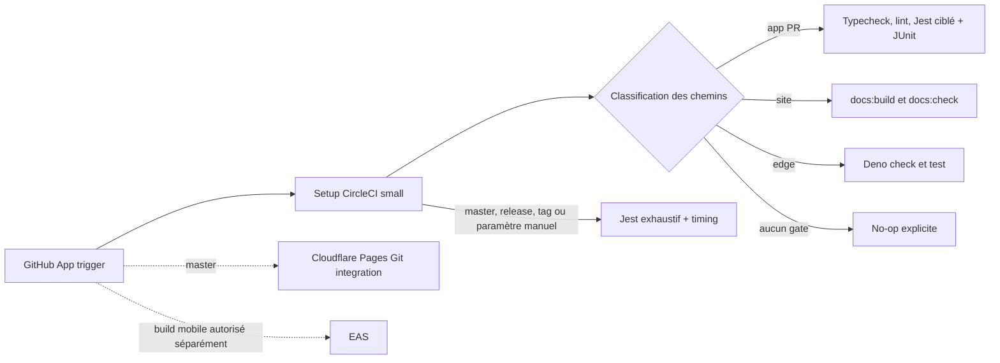

# Migration CI Noctalia vers CircleCI Free

État au 20 août 2026 : configuration CircleCI prête pour une phase parallèle.
Le workflow GitHub Actions `Quality` reste présent et aucune protection de branche
n'est modifiée par ce changement.

## Architecture et frontière des responsabilités

CircleCI ne contient aucune commande `wrangler pages deploy`, `docs:deploy:*`,
`eas build`, `eas submit`, migration Supabase ou publication. Cloudflare Pages
continue à construire et déployer le site depuis Git. EAS reste l'unique chemin
de build mobile distant. La CI valide les sources mais ne duplique aucune mutation.

## Mapping GitHub Actions vers CircleCI

| GitHub Actions `quality.yml` | CircleCI | Déclenchement |
| --- | --- | --- |
| `changes` | setup `classify-and-continue` + `classify-changes.sh` | Toutes les pipelines, `small` |
| `pr-quality` | `app-quality` + JSON/JUnit des tests changés | PR applicative ; aussi `master`/release pour les contrôles statiques |
| `test-fast` | `test-fast` + `store_test_results` | `master`, tag/release ou `force_full_validation=true` uniquement |
| artifact `jest-timing` + téléchargement du dernier succès `master` | artifact `jest-timing` + cache préfixé `jest-timing-master-v1-` | baseline publiée uniquement après succès de `master` |
| `site-build` | `site-build` | Sources site sur PR ; toujours sur `master`/release |
| `edge-functions` | `edge-functions` | Supabase/Deno sur PR ; toujours sur `master`/release |

Les commandes restent celles de `package.json` : `npm ci`, les deux typechecks,
`lint`, `lint:scripts`, `test:changed`, `test:fast`, `docs:build` et `docs:check`.
Les Edge Functions restent vérifiées avec Deno 2.7.14, `--frozen` et `--allow-env`.
Jest et Deno produisent aussi du JUnit pour l'onglet Tests, les insights et la
détection de tests instables. Le découpage par timings et `circleci tests run`
restent désactivés jusqu'à disposer de mesures CircleCI représentatives.

## Classification des chemins

La classification reprend les expressions de `quality.yml` :

- les fichiers sous `doc_web_interne/`, `marketing/`, `docs-src/`, `docs/`, les
  JSON sous `data/` et les Markdown n'activent pas à eux seuls les gates app ;
- `docs-src/`, `docs/`, `data/`, les générateurs/helpers site sous `scripts/` et
  les manifests npm activent le site ; un script applicatif sans rapport ne
  déclenche pas ce build ;
- `supabase/` et `deno.lock` activent Deno ;
- toute modification de `.circleci/` active les trois familles pour tester la CI ;
- une base Git absente ou inutilisable active les trois familles par sécurité.

Sur une PR, la base est le `merge-base` de la tête avec `origin/master`. Sur
`master`, une branche `release`, `release/*` ou un tag, les trois familles et la
suite Jest exhaustive sont forcées. Une pipeline lancée manuellement avec
`force_full_validation=true` prend le même chemin sans publier la baseline
`master`. Sur PR, seuls les tests Jest liés au diff s'exécutent et produisent
JSON/JUnit ; la suite exhaustive ne dépend jamais de `run_app` seul.

## Déclencheurs et prérequis CircleCI

Créer le projet via la GitHub App CircleCI et choisir le trigger **PR opened or
pushed to, default branch and tag pushes**. Cette option couvre les PR vers
`master`, les pushes sur `master` et les tags de release sans construire chaque
branche inactive. Activer **Dynamic Config** dans les paramètres avancés si le
projet CircleCI a été créé avant le 1er décembre 2023.

Les jobs setup et continués déclarent explicitement `tags: only: /.*/` : sans ce
filtre, CircleCI ignore par défaut les tags au niveau workflow. Aucun schedule
n'est défini dans cette première version ; une routine planifiée devra être
ajoutée comme workflow séparé, avec branche et paramètres explicites.

Aucun contexte CircleCI personnalisé n'est requis pour ces validations. Le seul
secret consommé par la continuation est `CIRCLE_CONTINUATION_KEY`, injecté
automatiquement et limité à la pipeline par CircleCI. Ne pas créer ni copier dans
CircleCI `CLOUDFLARE_API_TOKEN`, `CLOUDFLARE_ACCOUNT_ID`, `EXPO_TOKEN`,
`SUPABASE_ACCESS_TOKEN` ou des credentials de store : ces responsabilités restent
chez Cloudflare, EAS et les opérateurs de release.

Si une vraie branche `release/*` est introduite, ajouter un trigger CircleCI pour
ses pushes ; la configuration la traite déjà en pipeline complète. Aucune branche
release distante n'existait lors de la migration, donc les tags sont le chemin de
release initial.

## Baseline Jest et rapports de timing

Chaque `test-fast` stocke `artifacts/jest-results.json` comme artifact CircleCI.
Une pipeline `master` réussie copie le JSON dans un cache immuable dont la clé
contient un timestamp. Les tags et branches release exécutent la suite complète
sans remplacer cette baseline. Les pipelines exhaustives restaurent la
correspondance la plus récente du préfixe `jest-timing-master-v1-` et gardent le
budget de régression de 20 % strict dès que ce fichier existe. La première
pipeline `master` peut amorcer la baseline explicitement. Les PR stockent leur
propre JSON/JUnit de tests ciblés, sans comparaison trompeuse entre un sous-ensemble
et la durée de la suite complète.

La rétention des artifacts et caches dépend des réglages de stockage CircleCI ;
la confirmer dans l'organisation après les premières exécutions. Le JSON reste
consultable même si le test échoue lorsque Jest a réussi à l'écrire.

Les mécanismes de persistance ont chacun un rôle distinct :

- le cache npm, indexé exactement par Node 24 et le checksum de
  `package-lock.json`, ne contient que `/home/circleci/.npm` ; `npm ci` reconstruit
  toujours `node_modules` ;
- le cache Deno, indexé exactement par `deno.lock`, ne contient que `DENO_DIR` ;
- le cache Jest horodaté est l'exception volontaire aux clés stables : les caches
  CircleCI étant immuables, le préfixe restaure la baseline `master` la plus
  récente entre pipelines ;
- aucun workspace n'est nécessaire, car aucun résultat n'est transmis à un job
  aval dans le même workflow ;
- les JSON et XML sont des artifacts d'inspection, tandis que les XML sont aussi
  envoyés à `store_test_results` pour les fonctionnalités Tests de CircleCI.

## Estimation CircleCI Free figée

Hypothèses officielles consultées le 20 août 2026 : le plan Free fournit 30 000
crédits par mois ; Docker `small` coûte 5 crédits/minute et `medium` 10. Les
ressources Gen2, payantes, ne sont pas utilisées. Sources :
[tarification CircleCI](https://circleci.com/pricing/),
[liste des prix](https://circleci.com/pricing/price-list/) et
[configuration dynamique](https://circleci.com/docs/guides/orchestrate/using-dynamic-configuration/).

Hypothèses de durée à remplacer après 20 pipelines réels : setup 1 min,
app-quality 8 min, Jest 10 min, site 8 min, Edge 5 min, no-op 1 min.

| Scénario | Jobs estimés | Crédits/pipeline |
| --- | --- | ---: |
| Markdown/runbook seulement | setup small + no-op small | 10 |
| Source site seulement | setup small + site medium | 85 |
| App seulement | setup small + app medium, Jest ciblé inclus | 85 |
| Edge Function | setup small + app medium, Jest ciblé inclus + Edge small | 110 |
| `master`/release complet | setup small + app medium + Jest medium + site medium + Edge small | 290 |

Exemple mensuel de planification : 80 PR app, 20 PR site et 10 pipelines complètes
consomment environ 11 400 crédits, soit une marge estimée de 18 600 crédits. Le
plafond théorique imposé par les timeouts est de 700 crédits pour une pipeline
complète. Vérifier chaque mois `Plan Usage`, le nombre d'utilisateurs actifs et le
stockage ; les crédits Free ne sont pas reportés au mois suivant.

## Procédure de bascule

1. Fusionner ce commit en gardant GitHub Actions `Quality` requis.
2. Installer la GitHub App CircleCI, créer le projet, activer Dynamic Config si
   nécessaire et configurer le trigger recommandé ci-dessus.
3. Déclencher une pipeline `master` complète et vérifier les quatre jobs, le JSON
   Jest, le cache de baseline et l'absence de commande de déploiement.
4. Ouvrir quatre PR témoins : Markdown seul, `docs-src/`, app TypeScript et
   `supabase/functions/`. Comparer la sélection CircleCI au workflow GitHub.
5. Relever les noms exacts des checks GitHub émis par CircleCI et les durées de 20
   pipelines ; ajuster les hypothèses de crédits si nécessaire.
6. Après validation de l'orchestrateur seulement, ajouter les checks CircleCI aux
   protections, puis retirer l'exigence GitHub `Quality`. Ne pas supprimer encore
   `quality.yml`.
7. Après une fenêtre stable convenue, supprimer GitHub Actions dans un commit
   séparé. Cette dernière suppression n'appartient pas à la présente migration.

## Retour arrière

1. Rendre immédiatement GitHub Actions `Quality` obligatoire dans la protection
   de `master`.
2. Désactiver le trigger CircleCI du projet pour arrêter la consommation ; ne pas
   effacer d'abord la configuration, afin de préserver les preuves.
3. Diagnostiquer avec les artifacts CircleCI et les runs GitHub parallèles.
4. Corriger ou revert le commit CircleCI dans une PR ciblée.

Cloudflare et EAS ne changent pas pendant ce retour arrière : aucune bascule de
déploiement n'a été faite dans CircleCI.
