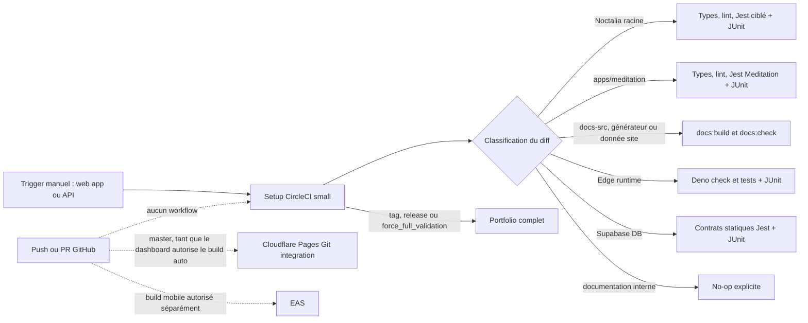

# Migration CI Noctalia vers CircleCI Free

État au 21 août 2026 : CircleCI est configuré en validation pure, sans commande
de déploiement. Le workflow GitHub Actions `Quality`, devenu une duplication de
la même validation, est retiré. Le ruleset de `master` ne requiert aucun check.

## Modèle actuel : contrôles locaux, PR, commentaires de revue

Décision du propriétaire du 9 octobre 2026 : la CI distante ne faisait que
rejouer ce que l'agent peut vérifier avant de pousser, et elle consommait des
crédits (machine `ubuntu-2404`, conteneurs TesterArmy parallèles). Désormais :

1. **Contrôle local automatique.** Le hook versionné `.githooks/pre-push` est
   installé par `npm ci` ou `npm install` : le script `prepare`
   (`scripts/install-git-hooks.js`) règle `core.hooksPath` sur `.githooks`,
   sauf hors dépôt Git (EAS, hébergeurs) ou si un autre chemin est déjà
   configuré. Le hook lance `npm run verify:fast` sur le commit extrait :
   `test:prepush` (classification décrite ci-dessous, types, Jest affecté, et
   `docs:build` plus `docs:check` quand le classificateur pose `run_site`),
   puis `lint` et `lint:scripts`. Si le classificateur ne sélectionne aucune
   surface produit (documentation interne, markdown de planification, `docs/`
   généré), lint est sauté ; le SHA du commit extrait reste affiché. Le
   contenu du site (`docs-src/`, générateurs, données symbole ou guide déjà
   routées vers le site) n'emprunte pas ce raccourci. Le hook ne fait rien
   pour une suppression de branche ou un push sans nouveau commit, refuse de
   tourner sans dépendances installées en affichant la commande
   d'installation, et affiche la commande lancée, le SHA et la durée.
   `git push --no-verify` reste possible pour un humain ; les agents ne
   l'utilisent jamais.
2. **Preuve écrite.** Le modèle `.github/pull_request_template.md` demande les
   commandes lancées, le SHA contrôlé, le résultat et ce qui reste non vérifié.
   La revue passe par les commentaires de la PR.
3. **CircleCI sur déclenchement manuel ou API uniquement.** Le workflow
   `setup` de `.circleci/config.yml` s'exécute si l'une de ces conditions est
   vraie : `pipeline.event.name` vaut `api` (application GitHub,
   [options de déclenchement](https://circleci.com/docs/guides/orchestrate/github-trigger-event-options/) ;
   le [cookbook](https://circleci.com/docs/guides/orchestrate/orchestration-cookbook/)
   précise que cette valeur est réservée à l'application GitHub) ;
   `pipeline.trigger.type` vaut `api` (intégration OAuth historique : `api`
   pour l'API ou le bouton Trigger Pipeline, `github_oauth` pour un webhook
   automatique, voir les
   [valeurs de pipeline](https://circleci.com/docs/reference/variables/)) ;
   `pipeline.trigger_source` vaut `api` (ancienne orthographe `api`, `webhook`,
   `scheduled_pipeline`, dépréciée au 2026-08-01 au profit de
   `pipeline.trigger.type` ; `webhook` et `scheduled_pipeline` ne lancent
   rien) ; ou `force_full_validation` vaut `true`. Un push webhook automatique
   ne consomme aucun crédit. `.circleci/continue.yml` est inchangé ;
   `.circleci/tests/fallback-jest.test.sh` vérifie chaque combinaison.
4. **Avant fusion**, si `master` a bougé depuis le contrôle, fusionner `master`
   dans la branche et repousser : le hook relance le contrôle sur la nouvelle
   tête, dont le SHA remplace celui de la preuve.

Lancer une pipeline manuelle : application web CircleCI, page *Pipelines* du
projet, *Trigger Pipeline*, branche de configuration et de checkout, puis
*Add +* pour `force_full_validation` = `true` si une validation complète est
voulue. Par l'API v2 (identifiant de définition dans *Project Setup*) :

```sh
curl -X POST https://circleci.com/api/v2/project/<project-slug>/pipeline/run \
  --header "Circle-Token: $CIRCLE_TOKEN" \
  --header "content-type: application/json" \
  --data '{"definition_id": "<pipeline-definition-id>",
    "config": {"branch": "<branche>"}, "checkout": {"branch": "<branche>"},
    "parameters": {"force_full_validation": true}}'
```

Une étape de release ou de publication qui exigeait une pipeline CircleCI verte
sur le SHA exige désormais que **la validation complète locale ait réussi sur
ce SHA exact (ou une pipeline CircleCI manuelle avec
`force_full_validation: true`)**. Ce choix ne prouve rien sur une machine
vierge : le contrôle tourne dans l'installation locale de l'auteur.

### Validation complète locale

Elle reprend les commandes `run` du portefeuille `full` de
`.circleci/continue.yml`, sur un checkout propre du SHA visé, après
`mise exec -- npm ci` à la racine et dans `apps/meditation` :

- Noctalia : `npm run dependencies:check`, `npm run boundaries:check`,
  `node scripts/mobile-release.js verify --app all`,
  `bash .circleci/tests/classify-changes.test.sh`,
  `python3 .circleci/tests/shared-build-impact.test.py`,
  `bash .circleci/tests/fallback-jest.test.sh`, `npm run typecheck:app`,
  `npm run typecheck:tests`, `npm run lint`, `npm run lint:scripts`,
  `npm run test:fast` ;
- Meditation : `node scripts/check-monorepo-boundaries.js --meditation`, puis
  dans `apps/meditation` `npm run dependencies:check`, `npm run typecheck`,
  `npm run lint` et `npm test -- --ci` ;
- site : `npm run docs:build`, `npm run docs:check`,
  `npm run test:testerarmy:site` ;
- Edge et contrats DB : les étapes Deno du job `edge-functions`,
  `npm run test:analysis-authorization:db` et la liste `test:file` du job
  `edge-contracts` ;
- parcours : `npm run test:e2e:backend` et les campagnes TesterArmy Dreamer
  (quatre passes de `tools/e2e/README.md`), Lucid et Meditation.

`continue.yml` reste la source de vérité de cette liste.

## Architecture et frontière des responsabilités


```mermaid
flowchart LR
  T[Trigger manuel : web app ou API] --> S[Setup CircleCI small]
  GH[Push ou PR GitHub] -. aucun workflow .-> S
  S --> C{Classification du diff}
  C -->|Noctalia racine| N[Types, lint, Jest ciblé + JUnit]
  C -->|apps/meditation| M[Types, lint, Jest Meditation + JUnit]
  C -->|docs-src, générateur ou donnée site| D[docs:build et docs:check]
  C -->|Edge runtime| E[Deno check et tests + JUnit]
  C -->|Supabase DB| B[Contrats statiques Jest + JUnit]
  C -->|documentation interne| Z[No-op explicite]
  S -->|tag, release ou force_full_validation| F[Portfolio complet]
  GH -. master, tant que le dashboard autorise le build auto .-> CF[Cloudflare Pages Git integration]
  GH -. build mobile autorisé séparément .-> EA[EAS]
```

CircleCI ne contient aucune commande `wrangler pages deploy`, `docs:deploy:*`,
`eas build`, `eas submit`, migration Supabase ou publication. Le site
(`noctalia.app`, projet Pages `noctalia`) est encore publié par l'intégration
Git du dashboard tant que *Enable automatic production branch deployments*
n'est pas coupé. Ce dépôt ne porte pas ce réglage. La publication manuelle est
décrite dans `AGENTS.md` (Publishing to production). EAS reste le chemin des
builds mobiles. Les contrôles DB sont
statiques : `db:contract:check` nécessite une base et reste une validation
opérateur, pas un accès implicite à une base distante depuis la CI.

## Mapping de l'ancien workflow GitHub Actions vers CircleCI

| Ancien job `quality.yml` | CircleCI | Déclenchement |
| --- | --- | --- |
| `changes` | setup `classify-and-continue` + `classify-changes.sh` | Toute pipeline manuelle, `small` |
| `pr-quality` | `noctalia-quality` + JSON/JUnit | Diff Noctalia racine ou entrée partagée vérifiée |
| non couvert auparavant | `meditation-quality` + JSON/JUnit | `apps/meditation/**` ou outil Node global |
| `test-fast` | suite complète dans `noctalia-quality` | tag/release ou `force_full_validation=true` seulement |
| artifact `jest-timing` | artifact + cache `jest-timing-master-v1-` (historique glissant) | baseline publiée seulement par un full manuel sur `master` |
| `site-build` | `site-build` | `docs-src/**`, générateurs et données partagées du site |
| `edge-functions` | `edge-functions` | Runtime Deno et lockfile Edge |
| contrats noyés dans Jest racine | `edge-contracts` | migrations, manifest DB et routes à contrat croisé |

Noctalia et Meditation sont deux packages indépendants. La racine exclut
`apps/**` de TypeScript et bloque l'arbre Meditation dans Metro ; Meditation a
son propre `package-lock.json`, son propre alias `@/*`, ses propres configs et
aucun import traversant vers la racine. Son job exécute donc exclusivement
`npm ci`, `typecheck`, `lint` et Jest depuis `apps/meditation`.

Noctalia garde les deux typechecks, `lint`, `lint:scripts` et les tests liés au
diff. Les validations complètes ajoutent `test:fast` dans le même job afin de ne
pas refaire un second `npm ci`. Tout `docs-src/**` suivi par le classificateur,
ainsi que les générateurs et les données partagées, lance `docs:build` et
`docs:check` (en CI manuelle et, localement, dans `verify:fast`). Cloudflare
Pages reconstruit ensuite le site. Edge
vérifie les quatre entrypoints Deno et teste `api` plus `revenuecat-webhook`.
Les contrats DB exécutent uniquement les huit tests Node qui lisent les
migrations, le manifest ou les routes partagées. Tous les jobs de test publient
du JUnit avec `store_test_results` et leur JSON de timing comme artifact.

## Classification des chemins

La classification est une allowlist avec repli fail-closed :

- `app/`, `components/`, `hooks/`, `context/`, `lib/`, `services/`, les tests,
  assets et configs racine activent Noctalia, sans site ;
- `apps/meditation/**` active seulement Meditation, y compris son package et
  son lockfile ;
- `docs-src/**` (y compris le contenu éditorial), `docs-src/static/scripts/**`,
  `docs-src/experience/**`, les entrées site de `data/` et les générateurs
  identifiés activent le build site (`docs:build` et `docs:check`) ; `docs/`
  généré seul produit un no-op ;
- `supabase/functions/`, `supabase/lib/` et les lockfiles Deno activent Deno ;
- migrations, manifest DB et tests de contrat identifiés activent seulement
  `edge-contracts` ; trois routes Edge lues directement par ces contrats
  activent Deno et les contrats, jamais Jest mobile ;
- `data/dream-symbols*.json`, `data/practicalDreamGuides.ts` et
  `docs-src/static/data/curation-pages.json` activent Noctalia et le site, car
  les imports croisés sont présents dans le code ;
- le package/lockfile racine active Noctalia, site et contrats Node, mais pas
  Meditation ni Deno ; `.nvmrc` active les quatre consommateurs Node ;
- `.circleci/**`, `quality.yml` et tout chemin global inconnu activent toutes
  les surfaces ; une base Git inutilisable fait de même sans forcer le portfolio
  exhaustif ;
- `doc_web_interne/`, `marketing/`, `specs/` et les Markdown isolés produisent
  un no-op explicite.

Les 250 premiers caractères du dernier commit peuvent aussi contenir
`[ci skip]` ou `[skip ci]` pour forcer ce no-op. Cette lecture n'a lieu qu'après
la classification des chemins, et seulement en mode `pr`/`main` : tags, branches
`release`/`release/*` et `force_full_validation=true` restent prioritaires.
L'opt-out ne couvre jamais une dépendance, Noctalia, Meditation, Supabase, une
donnée partagée ou un générateur.

Selon le type de trigger, CircleCI peut toutefois appliquer son saut natif sur
le push avant même d'exécuter ce classificateur. Le marqueur ne doit donc être
utilisé que sur un diff déjà entièrement éditorial/no-code ; le routage
automatique par chemins reste la méthode recommandée. Les suppressions,
renommages et copies classent l'ancien et le nouveau chemin comme une
modification : supprimer une page `docs-src/` ne lance que le site. Les
consommateurs partagés sont lus dans la table de la base et dans celle de la
PR, pour qu'une ligne retirée avec son fichier route encore ce chemin. Un
changement de type (fichier remplacé par un lien symbolique) ou une entrée
non fusionnée échoue fermé sur toutes les surfaces.

Les tests synthétiques couvrent Noctalia seul, Meditation seul, site no-op, Edge
Deno seul, migration seule, documentation interne, fichiers partagés, lockfiles,
générateurs `docs-src`, opt-out CI et fallback global.

## PR, master et validations complètes

Ces règles s'appliquent aux pipelines déclenchées manuellement, et à
`test:prepush` pour la sélection locale. Sur une branche, la base est le
`merge-base` avec `origin/master`. Sur `master`, la base est
`pipeline.git.base_revision`, soit la révision de la pipeline précédente : une
pipeline couvrant plusieurs commits rejoue donc chaque surface affectée sur tout
l'intervalle. Si cette base manque, n'est pas
récupérable ou n'est pas un ancêtre du head, le classificateur échoue fermé en
activant toutes les surfaces. Un changement Noctalia lance les tests liés au
diff ; Meditation utilise sa petite suite autonome ; le site et Edge restent
strictement indépendants.

Le portfolio complet est réservé aux pipelines manuelles sur un tag ou une
branche `release`/`release/*` et au paramètre manuel
`force_full_validation=true`. Si ce paramètre est lancé
sur `master`, la pipeline peut aussi publier la baseline Jest de référence ; sur
une autre branche elle exécute le portfolio sans remplacer cette baseline.
Aucun schedule n'est défini. Les filtres `tags: only: /.*/` sont explicites sur
tous les jobs.

## Caches, workspaces, artifacts et timing

- cache npm racine : clé exacte Node 24 + checksum du `package-lock.json`
  racine, store `/home/circleci/.npm` ;
- cache npm Meditation : clé distincte Node 24 + checksum de
  `apps/meditation/package-lock.json`, même type de store ;
- cache Deno : version 2.7.14 + checksum du lockfile réellement consommé,
  `supabase/functions/deno.lock`, stores `DENO_DIR` et `DENO_INSTALL` ;
- une seule surface racine sauvegarde le cache npm par pipeline ; les autres
  peuvent le restaurer, mais `npm ci` reconstruit toujours `node_modules` ;
- aucun workspace : les jobs sont indépendants et n'ont aucun résultat à se
  transmettre dans un même workflow ; déplacer `node_modules` coûterait plus de
  stockage et d'I/O que le cache du store npm ;
- les JSON/XML sont des artifacts d'inspection ; les XML sont aussi envoyés à
  `store_test_results` pour Tests, Insights et les tests instables.

La suite Noctalia complète restaure le cache immuable le plus récent au préfixe
`jest-timing-master-v1-`. La baseline est la moyenne de l'historique glissant
`artifacts/baseline/jest-timing-history.json` (les 5 derniers full `master`,
mis à jour par `check-jest-duration-regression.js --update-history` à chaque
publication), ce qui amortit la variance d'un runner isolé. Un cache antérieur
à l'historique retombe sur son `jest-results.json` à run unique, qui ensemence
l'historique à la publication suivante. Le budget de régression reste strict à
+20 % dès qu'une baseline existe. `--allow-missing-baseline` ne sert qu'au
bootstrap ; il ne relâche rien lorsqu'une référence est restaurée.

## Durée des parcours E2E

Mesure du 7 octobre 2026 (statuts GitHub des PR #252 à #255) : une PR
Noctalia attendait environ 30 min, presque entièrement sur
`testerarmy-dreamer`, qui enchaînait dans un seul conteneur les 75 parcours
en-US puis les contextes fr-FR, de-DE et fiches désactivées, chacun avec un
bundle Metro froid. `noctalia-e2e-web` suivait avec environ 20 min, un seul
worker Playwright.

Les mêmes tests s'exécutent désormais en parallèle :

- `testerarmy-dreamer-journeys` découpe le contexte en-US en huit tranches
  (`--shard`) ;
- `testerarmy-dreamer-contexts` découpe fr-FR sur deux conteneurs, puis
  exécute de-DE et fiches désactivées sur un troisième ;
- `testerarmy-dreamer` attache leur workspace et vérifie l'union exacte des
  identifiants passés et les quatre contextes. Une tranche absente ou en échec
  rend la campagne incomplète ;
- Dreamer et Lucid restaurent le cache Metro sauvegardé par `master`
  (`E2E_KEEP_METRO_CACHE=1`). `metro.config.js` intègre chaque entrée publique
  du build à la clé : un autre profil recompile. `master` repart à froid pour
  que le cache sauvegardé ne contienne qu'une révision.

Décision du 8 octobre 2026 : le job Playwright `noctalia-e2e-web` quitte la CI.
Ses 83 tests ont tous un équivalent TesterArmy exécuté par
`testerarmy-dreamer` (assertion de quota plus stricte, fuseau Europe/Paris
pour tous). La suite Playwright reste disponible en local
(`npm run test:e2e:web`).

Aucun test TesterArmy n'est retiré ou ignoré. Chaque conteneur paie son
installation : le temps total facturé augmente un peu, le temps d'attente
diminue. Le workspace Dreamer transporte environ 600 Mo de traces par
pipeline.

## Estimation CircleCI Free figée

Hypothèses officielles figées au 20 août 2026 : 30 000 crédits/mois, Docker
`small` 5 crédits/minute, Docker `medium` 10 crédits/minute. Sources :
[tarification CircleCI](https://circleci.com/pricing/),
[liste des prix](https://circleci.com/pricing/price-list/) et
[configuration dynamique](https://circleci.com/docs/guides/orchestrate/using-dynamic-configuration/).

Hypothèses hébergées à remplacer après un benchmark sériel : setup/no-op 1 min,
Noctalia affecté 8 min, Meditation 5 min, site 12 min, Edge 5 min sur `medium`,
contrats 4 min. Le site retient volontairement 12 min car la première exécution
réelle a approché 11 min 40.

| Diff | Avant | Après | Crédits estimés après |
| --- | --- | --- | ---: |
| Noctalia seul, PR/master | Noctalia ; master forçait aussi full/site/Edge | setup + Noctalia affecté | 85 |
| Meditation seul | Noctalia incorrectement ; Meditation non testée | setup + Meditation | 55 |
| Site SEO/vitrine seul | site ; master forçait tout | setup + no-op | 10 |
| Générateur ou donnée site partagée | site ; master forçait tout | setup + site | 125 |
| Edge Function simple | Noctalia + Edge ; master forçait tout | setup + Edge Deno | 55 |
| Migration DB | Noctalia + Edge Deno | setup + contrats ciblés | 45 |
| Documentation interne | no-op | no-op | 10 |

Un changement global affecté est volontairement plus cher, car il vérifie les
cinq gates. Le portfolio complet ajoute aussi la suite Noctalia exhaustive mais
reste rare par conception. `Plan Usage` et les durées CircleCI réelles doivent
remplacer ces hypothèses avant de prendre une décision de capacité. Depuis le
9 octobre 2026, ces montants ne concernent que les pipelines déclenchées
manuellement : une pipeline de push ou de PR n'exécute aucun job.

## Authentification requise

Aucun contexte CircleCI personnalisé n'est requis. La continuation utilise
`CIRCLE_CONTINUATION_KEY`, injecté automatiquement et limité à la pipeline. Ne
pas créer dans CircleCI `CLOUDFLARE_API_TOKEN`, `CLOUDFLARE_ACCOUNT_ID`,
`EXPO_TOKEN`, `SUPABASE_ACCESS_TOKEN`, `SUPABASE_DB_URL`, `DATABASE_URL` ou des
credentials de store : aucun de ces secrets n'est nécessaire aux gates locales.

Le projet reste connecté via la GitHub App CircleCI : le déclenchement manuel
en a besoin. Les triggers PR, branche par défaut et tags peuvent rester actifs,
leurs pipelines n'exécutant aucun workflow ; les désactiver dans *Project
Setup* évite aussi d'en créer. Dynamic Config doit rester activé.

## Procédure d'exploitation

1. Vérifier qu'un push de PR crée une pipeline sans workflow, puis qu'un
   déclenchement manuel de la même branche lance le setup et la classification.
2. Lancer `force_full_validation=true` sur `master` pour vérifier le portfolio,
   les cinq JUnit/artifacts attendus et amorcer la baseline Noctalia.
3. Observer les durées p50/p95 et recalculer les crédits après les changements
   structurels de routage.
4. Garder l'annulation des pipelines obsolètes activée par branche dans les
   réglages CircleCI.

## Retour arrière

Pour revenir à une CI automatique sur push et PR, retirer le `when` du workflow
`setup` de `.circleci/config.yml` et l'assertion correspondante de
`.circleci/tests/fallback-jest.test.sh` dans une PR ciblée.

Bascule historique depuis GitHub Actions :

1. Revert ciblé du commit de bascule pour restaurer `quality.yml`, puis attendre
   un run GitHub Actions réussi.
2. Désactiver le trigger CircleCI pour arrêter la consommation sans effacer les
   artifacts utiles au diagnostic.
3. Corriger ou revert la configuration CircleCI dans une PR ciblée.

Cloudflare et EAS ne changent pas pendant la bascule ou le retour arrière :
CircleCI n'est propriétaire d'aucun déploiement.
