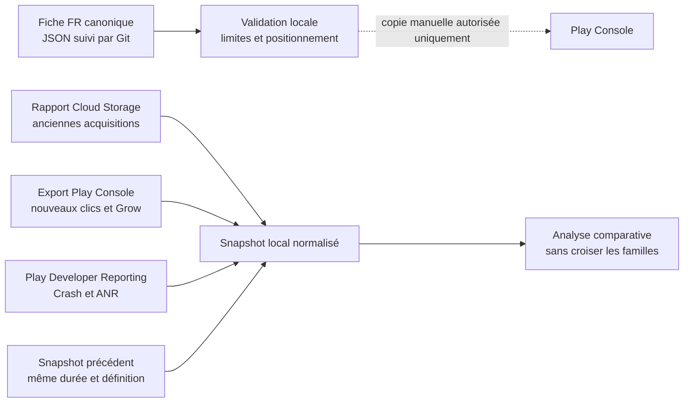

# Workflow Google Play / ASO de Noctalia

Dernière mise à jour : 2026-08-09

## Objectif et garde-fous

Ce workflow centralise la fiche française, le brief des captures Android et les mesures utiles à l’ASO. Il est conçu pour être reproductible et strictement non publiant.

- Aucun script ne modifie ni ne publie la fiche Play Store.
- Aucun script ne crée, ne valide ou ne supprime un edit Android Publisher.
- Les URI Cloud Storage, tokens, identifiants d’edit et métriques réelles restent dans des fichiers `*.local.json` ignorés par Git.
- Une absence de donnée, une réponse refusée ou un volume masqué par Google n’est jamais interprété comme zéro.
- Toute publication dans Play Console exige une autorisation explicite séparée.



## 1. Fiche française et captures Android

La source canonique est `marketing/aso/google-play-fr-2026-08-09.json`. Elle remplace, pour le français, le pack historique du 20 mai centré sur la voix.

Promesse principale : **un journal de rêves vivant**. La dictée reste une option de saisie secondaire.

```bash
npm run aso:google-play:check
```

Le contrôle échoue si :

- le titre dépasse 30 caractères, la description courte 80 ou la description longue 4 000 ;
- la promesse ne contient plus « journal de rêves vivant » ;
- la publication n’est plus déclarée manuelle et non autorisée ;
- les trois premières captures deviennent centrées sur la voix ou le microphone ;
- le brief ne contient plus entre 2 et 8 captures ordonnées.

Le brief suivi dans le même JSON contient 7 captures. Les trois premières prouvent successivement le journal vivant, les symboles récurrents et l’évolution au fil des nuits. Tous les visuels doivent utiliser une interface Android, sans Dynamic Island.

## 2. Familles de métriques : ne pas les fusionner

| Famille | Source | Automatisation | Usage |
|---|---|---|---|
| Anciennes acquisitions, visiteurs et conversion de fiche | Rapports mensuels Cloud Storage | Oui | Tendance historique, avec définition héritée |
| Nouveaux visiteurs, clics d’installation uniques et CTR | Play Console, export ou relevé normalisé | Partielle | Diagnostic de conversion actuel |
| Impressions, acquisitions, premières ouvertures, actifs et rétention | Grow Overview dans Play Console | Partielle | Funnel et engagement à faible volume |
| Crash rate et ANR rate | Play Developer Reporting API v1beta1 | Oui, si le scope OAuth est accordé | Qualité technique et visibilité |
| Titre et descriptions publiés | Android Publisher `edits.listings.get` | Oui, seulement avec un `editId` existant | Contrôle d’écart avec la source canonique |

Les rapports Cloud Storage actuels n’exposent pas les nouvelles métriques de clic. Le snapshot les conserve donc dans des familles distinctes. Une comparaison n’est déclarée valide que pour la même famille, le même segment, la même unité et la même durée.

## 3. Rapport Store Performance via Cloud Storage

Dans Play Console : **Télécharger des rapports → Statistiques → Noctalia → Performances sur le Play Store**. Copier l’URI ou télécharger la répartition des sources de trafic du mois voulu.

Le fichier porte une extension `.csv`, mais Google le livre actuellement compressé avec gzip et encodé en UTF-16LE. Le collecteur détecte automatiquement ces deux formats, accepte aussi l’UTF-8, filtre `com.tanuki75.noctalia`, puis agrège sans conserver les termes de recherche ni les UTM.

Avec une URI Cloud Storage :

```bash
npm run aso:google-play:snapshot -- \
  --store-performance '<URI_GCS_COPIÉE_DEPUIS_PLAY_CONSOLE>' \
  --console-observation doc_web_interne/docs/google-play-aso-console-observation.local.json
```

Avec un fichier téléchargé :

```bash
npm run aso:google-play:snapshot -- \
  --store-performance /chemin/vers/store-performance.csv \
  --console-observation doc_web_interne/docs/google-play-aso-console-observation.local.json
```

La sortie par défaut est `doc_web_interne/docs/google-play-aso-performance-state.local.json`, ignorée par Git. L’URI privée du bucket n’est jamais écrite dans le snapshot.

## 4. Nouveaux clics et Grow Overview

Copier le schéma suivi :

```bash
cp doc_web_interne/docs/google-play-aso-console-observation.example.json \
  doc_web_interne/docs/google-play-aso-console-observation.local.json
```

Puis remplacer les valeurs par un export ou un relevé de Play Console, avec :

- une période courante et la période de comparaison affichée ;
- une entrée par `family`, `id` et `segment` ;
- l’unité `count`, `percent` ou `ratio` ;
- `change_percent_vs_previous_period` uniquement quand Play Console le fournit.

Le snapshot conserve ces variations comme `reported_period_comparison`. Il ne reconstruit pas artificiellement les volumes précédents à partir de pourcentages arrondis.

## 5. Android Vitals via l’API officielle

```bash
npm run aso:google-play:vitals -- \
  --start 2026-07-12 \
  --end 2026-08-09
```

`--end` est une borne exclusive. Les requêtes utilisent `DAILY` et le fuseau imposé `America/Los_Angeles`. Deux ensembles sont exportés :

- `crashRate`, `userPerceivedCrashRate`, `distinctUsers` ;
- `anrRate`, `userPerceivedAnrRate`, `distinctUsers`.

Authentification, par priorité :

1. `GOOGLE_PLAY_REPORTING_ACCESS_TOKEN` ;
2. Application Default Credentials locales.

Le jeton doit inclure le scope `https://www.googleapis.com/auth/playdeveloperreporting` et le compte doit pouvoir afficher les informations de l’application dans Play Console. Au 9 août 2026, les ADC locales atteignent bien l’API mais la requête est refusée avec `403 insufficient authentication scopes`. Le script produit un message d’action précis et n’écrit aucun faux résultat.

Une authentification interactive peut être préparée manuellement, en connaissance de cause :

```bash
gcloud auth application-default login \
  --scopes=https://www.googleapis.com/auth/cloud-platform,https://www.googleapis.com/auth/playdeveloperreporting
```

Ne jamais additionner `distinctUsers` entre les jours : Google arrondit cette valeur et un même utilisateur peut apparaître sur plusieurs jours.

## 6. Lecture de la fiche via Android Publisher

L’API Android Publisher n’offre pas de lecture de fiche indépendante d’un edit. La méthode officielle est un `GET` sur `edits.listings.get`, avec le scope large `androidpublisher`.

```bash
npm run aso:google-play:listing -- \
  --edit-id '<EDIT_ID_EXISTANT>' \
  --language fr-FR
```

Le script refuse de fonctionner sans `editId`. Il n’appelle jamais `edits.insert`, `update`, `patch`, `commit` ou `delete`. S’il n’existe aucun edit, comparer la source canonique à la fiche publique ; ne pas créer un edit au nom de ce workflow en lecture seule.

## 7. Comparaison avec un snapshot précédent

```bash
npm run aso:google-play:snapshot -- \
  --store-performance /chemin/vers/store-performance.csv \
  --console-observation doc_web_interne/docs/google-play-aso-console-observation.local.json \
  --vitals doc_web_interne/docs/google-play-vitals-state.local.json \
  --baseline /chemin/vers/snapshot-precedent.json
```

Deux comparaisons coexistent :

- `reported_period_comparison` reprend les deltas affichés par Play Console ;
- `comparison` calcule les écarts entre deux snapshots locaux compatibles.

Si la durée ou l’unité diffère, le résultat est marqué `comparable: false` au lieu de produire un pourcentage trompeur. À faible volume, quelques appareils peuvent faire varier fortement les pourcentages ; il faut lire les volumes absolus en premier.

## 8. Validation du workflow

```bash
npm run aso:google-play:check
npm run test:file -- \
  scripts/check-google-play-aso.test.js \
  scripts/build-google-play-aso-snapshot.test.js \
  scripts/export-google-play-vitals.test.js \
  scripts/export-google-play-listing.test.js \
  --watchman=false
npm run lint:scripts
```

Références officielles :

- [Rapports Google Play dans Cloud Storage](https://support.google.com/googleplay/android-developer/answer/6135870)
- [Requêtes Play Developer Reporting](https://developers.google.com/play/developer/reporting/metricset-queries)
- [Crash rate query](https://developers.google.com/play/developer/reporting/reference/rest/v1beta1/vitals.crashrate/query)
- [ANR rate query](https://developers.google.com/play/developer/reporting/reference/rest/v1beta1/vitals.anrrate/query)
- [Android Publisher edits.listings.get](https://developers.google.com/android-publisher/api-ref/rest/v3/edits.listings/get)
