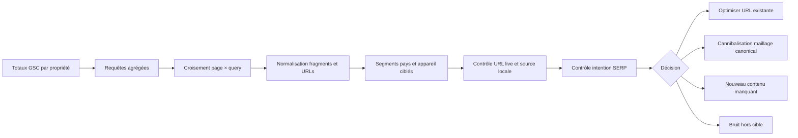

# Noctalia — J26 GSC content opportunities

Date d'analyse : 10 août 2026

Propriété : `sc-domain:noctalia.app`

Mode : GSC/API en lecture seule, HTTP public en lecture seule, zéro appel Ahrefs, zéro crédit général, aucune indexation, aucune publication

## Décision exécutive

Le croisement `page × query` ne confirme **aucune nouvelle page à créer immédiatement**. Après revue chef SEO, les écarts apparents sont traités comme des mesures ou des corrections séparées, pas comme un lot d'édition général :

1. `sognare acqua sporca` conserve le mapping `/it/simboli/acqua` pour l'intention courte et `/it/guides/simboli-sogni-acqua` pour les scénarios larges. Le basculement page-level de la fiche de 94 à 909 impressions, pendant que le guide passe de 578 à 506, indique que la modification du 16 juillet semble déjà déplacer l'ownership. Statut : **HOLD mesure**, sans nouvelle édition de contenu, métadonnées ou ancres, sans troisième page et sans cross-canonical.
2. `traumlexikon` reste attribué au lexique informationnel, tandis que `/de/traumlexikon-app` reste réservé à l'intention produit. La seule correction chirurgicale a été autorisée puis appliquée dans `docs-src/content/pages/page.android-dream-analysis-app/de.md:67` : l'ancre générique devient `Traumlexikon-App für Android`. Statut : **GO séparé implémenté dans la source**, à distinguer d'un push, d'un déploiement et d'un effet SEO mesuré.
3. Le cluster allemand générique `Traumdeutung` comporte quatre URL à comparer, dont le hub existant `/de/blog/traumbedeutungen-interpretation-symbole`, omis de la première cartographie. Statut : **HOLD architecture** ; ne pas promouvoir le guide des symboles fréquents avant cette comparaison.
4. `/en/dream-journal-apps` a reçu des modifications entre le 8 et le 10 août, après la coupure GSC du 7 août. Statut : **HOLD**, jusqu'à une fenêtre de 28 jours entièrement postérieure au dernier déploiement public vérifié.
5. `50 sueños y su significado` et `traumsymbole a bis z` sont déjà servis par leurs dictionnaires dédiés. Il faut protéger ces URL, pas créer de doublon.

| Lot | Statut après revue | Action autorisable suivante |
|---|---|---|
| IT `acqua sporca/torbida` | `HOLD_MESURE` | mesurer une fenêtre entièrement postérieure au 16 juillet ; revoir les ancres seulement si le partage persiste |
| DE `traumlexikon` | `GO_SEPARE` | ancre produit renommée après autorisation ; vérifier le déploiement avant de démarrer la mesure |
| DE `Traumdeutung` | `HOLD_ARCHITECTURE` | comparer les quatre URL avant toute redistribution de rôle |
| EN `dream journal app` | `HOLD_POST_DEPLOIEMENT` | attendre 28 jours complets après le dernier déploiement public vérifié |
| Nouveau contenu | `AUCUNE_NOUVELLE_PAGE` | 0 contenu à créer maintenant |

Les données GSC disponibles s'arrêtent au **7 août 2026**, revalidé par un probe API du 7 au 9 août qui ne renvoie qu'une journée finalisée. La vague metadata `casa`–`ragno`–`perro`, publiée le 8 août, n'est donc pas mesurée ici. `scuola` reste séparée et non publiée.

## Méthode robuste

Principes appliqués :

- les métriques de cluster viennent de `queries.csv`, agrégé par propriété, afin de ne pas gonfler les impressions quand plusieurs URL ou fragments apparaissent pour une même recherche ;
- `page-query.csv` sert à attribuer chaque intention aux URL visibles et à détecter les répartitions concurrentes ;
- les fragments `#...` sont ramenés à l'URL de base pour la déduplication décisionnelle, sans réécrire les exports bruts ;
- les segments `query × page × country × device` ne sont extraits que pour les clusters retenus ;
- les locales ne sont pas fusionnées. Un terme ambigu comme `examen` en espagnol et en français n'entre pas dans un agrégat multilingue ;
- les totaux requêtes ne sont pas présentés comme exhaustifs : Google omet des requêtes anonymisées et tronque certaines tables ;
- la différence entre agrégation par propriété et par page est conservée. Google compte séparément plusieurs URL dans l'agrégation par page, mais une seule présence dans l'agrégation par propriété.

Références Google : [agrégation propriété vs page](https://support.google.com/webmasters/answer/17011364?hl=en), [requêtes anonymisées et troncation](https://support.google.com/webmasters/answer/17011259?hl=en), [fraîcheur et écarts de données](https://support.google.com/webmasters/answer/17010575?hl=en), [API Search Analytics](https://developers.google.com/webmaster-tools/v1/searchanalytics/query).

## Fenêtres et fraîcheur

| Fenêtre | Dates complètes | Clics | Impressions | CTR | Position | Comparaison |
|---|---|---:|---:|---:|---:|---|
| 28 jours | 11 juillet–7 août | 4 271 | 481 573 | 0,887 % | 7,32 | +80,3 % clics, +56,8 % impressions, +0,116 point de CTR, position améliorée de 1,20 |
| 28 jours précédente | 13 juin–10 juillet | 2 369 | 307 209 | 0,771 % | 8,52 | période de même longueur |
| 90 jours | 10 mai–7 août | 8 052 | 1 123 231 | 0,717 % | 8,71 | +624,8 % clics, +194,1 % impressions, +0,426 point de CTR, position améliorée de 1,92 |
| 90 jours précédente | 9 février–9 mai | 1 111 | 381 858 | 0,291 % | 10,63 | période de même longueur |
| 12 mois demandés | 8 août 2025–7 août 2026 | 9 241 | 1 543 417 | 0,599 % | 9,33 | 246 jours avec données, à partir du 5 décembre 2025 |

La croissance du site et l'élargissement récent du corpus dominent les comparaisons. Les deltas ne sont pas attribués à une seule modification SEO.

## Saisonnalité sur 12 mois

| Mois | Jours observés | Clics | Impressions | Clics/jour | Impressions/jour | CTR | Position |
|---|---:|---:|---:|---:|---:|---:|---:|
| Déc. 2025 | 27 | 15 | 2 706 | 0,6 | 100 | 0,55 % | 23,12 |
| Janv. 2026 | 31 | 55 | 30 774 | 1,8 | 993 | 0,18 % | 13,29 |
| Févr. 2026 | 28 | 76 | 27 610 | 2,7 | 986 | 0,28 % | 19,75 |
| Mars 2026 | 31 | 329 | 97 742 | 10,6 | 3 153 | 0,34 % | 12,97 |
| Avril 2026 | 30 | 515 | 198 382 | 17,2 | 6 613 | 0,26 % | 8,07 |
| Mai 2026 | 31 | 1 047 | 266 076 | 33,8 | 8 583 | 0,39 % | 11,47 |
| Juin 2026 | 30 | 1 909 | 311 948 | 63,6 | 10 398 | 0,61 % | 9,35 |
| Juil. 2026 | 31 | 4 338 | 476 896 | 139,9 | 15 384 | 0,91 % | 7,32 |
| Août 2026 | 7 | 957 | 131 283 | 136,7 | 18 755 | 0,73 % | 8,01 |

Cette série ne permet pas encore d'isoler une saisonnalité annuelle : il n'existe pas de mois comparable sur deux années et décembre/août sont partiels. Elle montre une montée de couverture et de visibilité, pas un cycle saisonnier prouvé.

## Cas imposés

Les métriques ci-dessous sont les requêtes exactes, agrégées par propriété. La répartition d'URL vient du croisement `page × query`.

| Requête | 28 jours : clics / impr. / CTR / pos. | Répartition page-level visible | Verdict |
|---|---|---|---|
| `50 sueños y su significado` | 6 / 151 / 3,97 % / 2,97 | 151 impr. sur `/es/guides/diccionario-simbolos-suenos` | Le dictionnaire suffit. Protéger et maintenir ; aucune nouvelle page. |
| `traumlexikon` | 0 / 74 / 0 % / 12,47 | lexique 67 impr. ; page app 13 ; accueil 1 | Lexique = propriétaire informationnel ; page app = produit. Correction séparée appliquée : ancre produit explicitée. |
| `sognare acqua sporca` | 1 / 529 / 0,19 % / 5,75 | fiche eau 363 impr. ; guide eau 178 ; blog 2 | Mapping conservé et édition en HOLD : mesurer le basculement en cours ; aucune troisième URL ni cross-canonical. |
| `traumsymbole a bis z` | 180 / 673 / 26,75 % / 1,65 | lexique 667 impr. ; guide fréquent 8 ; blog 1 | GSC valide la cible Rank Tracker `/de/guides/traumsymbole-lexikon`. Protéger cette cible. |

Confrontation au Rank Tracker existant : le portefeuille versionné associe `traumsymbole a bis z` au tag `target-de-dictionary` et à `/de/guides/traumsymbole-lexikon`. GSC confirme cette cible. Le snapshot J25 signalait en revanche des dérives mobile vers `/` pour `traumlexikon` et `50 sueños…`, et desktop vers `/Home/Simboli` pour `sognare acqua sporca`. GSC sur 28/90 jours montre que ces URL Ahrefs ne sont pas les propriétaires dominants : le signal Ahrefs est un relevé SERP ponctuel, non un motif de retargeting.

## Clusters décisionnels

### Mesurer ou corriger dans un lot séparé

- **Italien, eau sale — `HOLD_MESURE`** — le cluster visible totalise 4 clics et 1 349 impressions au niveau requête/propriété, avec un CTR de 0,30 % et une position de 6,09 sur 28 jours pour 31 variantes. Le mapping reste : fiche `/it/simboli/acqua` pour l'intention courte `acqua sporca/torbida`, guide `/it/guides/simboli-sogni-acqua` pour eau propre, maison, mer, alluvione et mouvement. La fenêtre courante commence le 11 juillet et n'est donc pas entièrement postérieure à la modification du 16 juillet. Ne modifier maintenant ni contenu, ni métadonnées, ni ancres. Revoir les ancres seulement si deux propriétaires persistent après une fenêtre entièrement postérieure à cette modification. Aucune troisième page et aucun cross-canonical.
- **Allemand, `traumlexikon` — `GO_SEPARE`** — le lexique domine et conserve l'intention informationnelle ; la page app conserve l'intention produit. Après autorisation distincte, l'ancre générique de `docs-src/content/pages/page.android-dream-analysis-app/de.md:67` a été renommée en `Traumlexikon-App für Android`. Il s'agit d'une modification de source : elle ne prouve ni push, ni déploiement, ni effet SEO.
- **Anglais, `dream journal app` — `HOLD_POST_DEPLOIEMENT`** — la baseline arrêtée au 7 août est de 0 clic, 53 impressions et une position de 10,51, surtout aux États-Unis. Elle ne peut évaluer aucune modification du 8 au 10 août. Ne modifier ni snippet ni contenu avant 28 jours complets comptés depuis le dernier déploiement public vérifié, et non depuis le commit.

Pour le cluster italien, les métriques propriété et page-level restent volontairement séparées :

| Fenêtre | Requête/propriété | Fiche page-level | Guide page-level | Autres URL page-level | Total page-level |
|---|---:|---:|---:|---:|---:|
| 13 juin–10 juillet | 0 clic / 637 impr. | 94 impr. | 578 impr. | 0 impr. | 672 impr. |
| 11 juillet–7 août | 4 clics / 1 349 impr. | 909 impr. | 506 impr. | blog 17 + pluie 1 | 1 433 impr. |

Les 1 349 impressions propriété ne doivent pas être additionnées ou comparées comme si elles étaient le total des lignes page-level : Google peut compter plusieurs URL pour une même requête dans l'agrégation par page.

### Cannibalisation, maillage ou canonical

- **Allemand générique `Traumdeutung` — `HOLD_ARCHITECTURE`** — 5 clics, 462 impressions, position 6,68. La cartographie doit comparer quatre URL : le hub existant `/de/blog/traumbedeutungen-interpretation-symbole`, le guide `/de/guides/haeufigste-traumsymbole`, le lexique `/de/guides/traumsymbole-lexikon` et l'article sur les rêves récurrents. Le title, le H1 et la description du premier le positionnent déjà comme une `Drehscheibe` des significations. Ne pas promouvoir le guide des symboles fréquents comme hub générique avant comparaison. Conserver le lexique pour `traumlexikon` et A–Z, la page app pour le produit, et l'article récurrent pour les rêves récurrents. Ce dernier conserve environ 260 impressions DACH à une position proche de 3 ; une dé-optimisation non étayée ferait courir un risque de perte.
- **Italien, poursuite** — la fiche `/it/simboli/inseguimento` et le blog `/it/blog/sogni-inseguiti-significato-e-interpretazione` se partagent les variantes. Action : fiche pour le symbole court, blog pour les scénarios et causes ; ancres distinctes.
- **Espagnol, inondation** — le blog `/es/blog/suenos-de-agua` possède très largement l'intention longue ; la fiche `/es/simbolos/inundacion` reste une référence courte. Les fragments `#simbolismo`, `#tipos`, `#estado`, `#interpretaciones` gonflent les lignes page-level mais pas les métriques propriété. Action : conserver le blog comme propriétaire et ne pas créer de doublon.

### Gagnants à protéger

- **Dictionnaire espagnol** — le cas `50 sueños…` est résolu par une page dédiée, HTTP 200, auto-canonique, indexable et présente au sitemap.
- **Lexique allemand A–Z** — les deux formulations A–Z agrégées totalisent 259 clics, 3 086 impressions, CTR 8,39 %, position 5,52 sur 28 jours ; la requête exacte `traumsymbole a bis z` est bien plus forte. Toute refonte risquerait de diluer une cible validée.
- **Loup, hôpital et feu** — les fiches dédiées captent presque seules leurs clusters. Leur faible CTR doit être lu avec leur position, leurs marchés mobiles et la forte croissance générale ; ce ne sont pas des pages manquantes.

### Bruit ou hors cible

- `dream place meaning in hindi` : 0 clic, 110 impressions, position 10,61, presque uniquement Inde mobile, sur un guide anglais. Ne pas créer de locale Hindi sur ce seul signal.
- requêtes `togel` : 1 clic, 116 impressions, position 20,65, presque uniquement Indonésie. Intention loterie hors produit ; ne pas optimiser.
- `noctalia caffeine` : 0 clic, 21 impressions, position 7,95, répartition diffuse sur plusieurs articles anglais. Collision de marque hors cible ; surveiller seulement.

## Contrôles SERP manuels

- `50 sueños y su significado` : la SERP est de type dictionnaire/liste. [La page Noctalia dédiée](https://noctalia.app/es/guides/diccionario-simbolos-suenos) répond directement à l'intention et concurrence des listes comme [Dreamterpreter](https://www.dreamterpreter.co/blog/diccionario-de-suenos). Verdict : pas de nouveau contenu.
- `traumlexikon` et `traumsymbole a bis z` : la SERP privilégie les lexiques navigables et les listes A–Z, par exemple [Traumdeutung-Lexikon](https://www.traumdeutung-lexikon.de/), [Traumdeutung24](https://traumdeutung24.org/traumlexikon-traumsymbole-von-a-bis-z/) et [Traumsymbole-Traumdeutung](https://www.traumsymbole-traumdeutung.de/lexikon). Le lexique Noctalia est le bon format ; la page app est une intention distincte.
- `sognare acqua sporca` : plusieurs résultats sont des articles exacts dédiés, notamment [Microbiologia Italia](https://www.microbiologiaitalia.it/neurologia/sognare-acqua-sporca-significato-e-interpretazione/) et [Alfemminile](https://www.alfemminile.com/psicologia-e-relazioni/sognare-acqua-sporca/). Noctalia possède déjà une fiche dont le title et la FAQ couvrent eau propre, limpide ou sale, et l'ownership page-level est en train de basculer vers elle. Verdict : mesurer une fenêtre entièrement postérieure au 16 juillet avant toute nouvelle édition ou nouvelle URL.

## Indexabilité et échantillonnage manuel

Seize URL ont été contrôlées en HTTP public. Toutes répondent 200, déclarent `index, follow`, sont auto-canoniques et utilisent la bonne langue. Treize URL décisionnelles ont aussi été retrouvées dans le sitemap live, notamment les deux dictionnaires, les trois pages italiennes sur l'eau, les deux pages espagnoles sur l'inondation, la page anglaise d'app, `ragno`, `casa`, `perro` et `scuola`.

L'échantillon source confirme :

- la fiche italienne eau contient déjà `pulita`, `limpida`, `torbida`, `sporca`, eau qui coule et eau dans la maison ;
- le blog espagnol inondation contient des sections dédiées à l'eau sale, la maison, la mer, la fuite et l'eau propre ;
- la page app allemande renvoie explicitement vers le lexique public ;
- `/de/blog/traumbedeutungen-interpretation-symbole` existe déjà comme `CollectionPage`, avec un title/H1 `Traumbedeutungen: Interpretation & Symbole` et une description de hub `Drehscheibe` ;
- les dictionnaires espagnol et allemand sont de vraies pages A–Z, pas des landing pages minces.

## Contrôles qualité des exports

| Contrôle | 12 mois | 90 j préc. | 90 j | 28 j préc. | 28 j |
|---|---:|---:|---:|---:|---:|
| Lignes quotidiennes | 246 | 90 | 90 | 28 | 28 |
| Lignes requêtes | 23 080 | 11 175 | 17 130 | 8 973 | 10 306 |
| Lignes pages | 1 261 | 632 | 1 165 | 807 | 920 |
| Lignes `page × query` | 28 082 | 12 034 | 20 987 | 11 178 | 12 777 |
| Doublons exacts `(page, query)` | 0 | 0 | 0 | 0 | 0 |
| Lignes avec fragment | 2 219 | 88 | 2 203 | 1 546 | 1 506 |
| Couples normalisés `(URL sans fragment, query)` | 25 863 | 11 946 | 18 784 | 9 632 | 11 271 |

Sur 28 jours, la table requêtes visible ne couvre que 30,5 % des clics et 23,4 % des impressions du total propriété. Sur 90 jours, elle couvre 28,8 % et 23,5 %. Cette perte est cohérente avec l'anonymisation/troncation documentée par Google. Les métriques de cluster sont donc des minimums visibles ; les totaux page restent l'autorité pour la performance d'une URL.

Les pages totalisent 115,4 % des impressions propriété sur 28 jours et 113,7 % sur 90 jours. Ce n'est pas une erreur de CSV : plusieurs URL de la même propriété peuvent être comptées séparément au niveau page. C'est précisément pourquoi le backlog utilise les métriques requête/property et la distribution page×query séparément.

## Expériences à ne pas confondre

- `casa`, `ragno`, `perro` : les valeurs GSC arrêtées au 7 août sont des baselines pré-publication. La vague metadata a été publiée le 8 août et reste gelée jusqu'au 5 septembre ; première lecture seulement le 15 août.
- `/en/dream-journal-apps` : les valeurs arrêtées au 7 août précèdent les modifications du 8 au 10 août. Le gate de 28 jours démarre au dernier déploiement public vérifié ; un commit seul ne prouve ni publication ni début de mesure.
- `scuola` : le cluster de requêtes visibles contenant `scuola` totalise 0 clic, 209 impressions, CTR 0 % et position 6,90 sur les 28 jours. Ce n'est pas le total de la page : la baseline page-level J24 reste 6 clics et 1 900 impressions du 10 juillet au 6 août. Aucun changement `scuola` n'est publié. Ce signal ne doit pas être attribué à la vague du 8 août et ne déclenche aucune implémentation dans ce lot.

## Recommandation Free vs Starter

### Exécutable après retour à Ahrefs Free

1. mesurer `acqua sporca/torbida` sur une fenêtre entièrement postérieure au 16 juillet, sans nouvelle édition ;
2. intégrer l'ancre produit allemande désormais renommée en `Traumlexikon-App für Android`, puis dater son déploiement public vérifié avant toute mesure ;
3. cartographier en lecture seule les quatre URL allemandes du cluster `Traumdeutung`, sans redistribuer leurs rôles avant preuve ;
4. attendre 28 jours complets après le dernier déploiement public vérifié de `/en/dream-journal-apps` ;
5. continuer les comparaisons GSC 28/90 jours et les contrôles HTTP/sitemap ;
6. laisser `casa`, `ragno`, `perro` gelés et `scuola` séparée jusqu'à leurs gates respectifs.

Ces actions reposent sur GSC, le dépôt et le site public ; elles ne nécessitent pas Starter.

### Nécessite Starter ou une source payante équivalente

- actualiser l'historique Rank Tracker par pays et appareil au-delà des 50 couples conservés ;
- obtenir une SERP historique structurée et des comparaisons concurrentielles à grande échelle ;
- relancer Content Gap/Keywords Explorer/Site Explorer pour quantifier des sujets absents, après vérification préalable des crédits généraux ;
- faire un nouveau crawl Ahrefs du projet si une question technique nouvelle le justifie.

Starter n'est **pas nécessaire** pour les mesures, les HOLD ou la correction chirurgicale appliquée ici. Il devient utile si l'ownership italien reste partagé, pour une comparaison historique/concurrentielle structurée, ou pour élargir la recherche à de nouveaux marchés. Avant tout appel Ahrefs général, il faut revalider `Limits & Usage` dans l'interface et obtenir une autorisation explicite.

## Données et limites de conservation

Les exports bruts et le fichier de segmentation sont conservés hors Git sous `/private/tmp/noctalia-gsc-content-opportunities/`. Seuls ce rapport, le backlog agrégé et la synthèse sans longue traîne sont versionnables. Aucun export brut, token, capture, demande d'indexation ou état mutable GSC/Ahrefs n'a été ajouté au dépôt.
